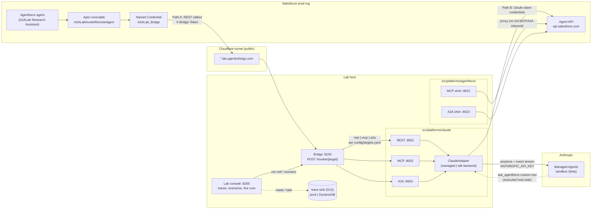

# A2A Interop Lab

Cross-platform agent-to-agent interoperability experiments: Salesforce
Agentforce ↔ Claude (↔ OpenAI on AWS later), with each direction runnable
over platform-native REST, MCP, and the A2A protocol — same scenario, same
question, protocols compared side by side with the raw wire payloads visible.

- **Plan & decisions:** [plan/](plan/) — decision log, architecture +
  protocol mapping rules, honest protocol matrix, results, runbooks.
- **Claude agent:** `src/platforms/claude/` — one adapter, two backends:
  Anthropic **Managed Agents (beta)** (default) and the self-hosted
  **Claude Agent SDK** (`CLAUDE_BACKEND=sdk`).
- **Agentforce:** `src/platforms/agentforce/` — GA Agent API client + MCP/A2A
  shims. The agent itself is authored in **Agent Script** (ADR D14): the
  authoring bundle in `salesforce/.../aiAuthoringBundles/` is the source of
  truth, published with `sf agent validate|publish|activate`. Account answers
  are grounded in real CRM records via an Apex action
  (`A2ALabGetAccountSummary` — Account + open Opportunities + Cases).
- **Bridge:** `src/bridge/` — Agentforce's REST callout fans out to any
  target/protocol per `config/targets.yaml`; no Salesforce redeploy to switch.
- **Lab console:** `src/console/` (:8200) — an experiment workspace styled
  after labs.agentforce.com (navy hero, gradient wordmark, experiment
  tiles with per-scenario call-path strips). The landing page explains the
  lab and its business cases; the sidebar has top-level accordions for
  Experiments, Protocol calls (single hops, with a plain "via bridge"
  toggle), and Traces. Pick a scenario, chat with it multi-turn (**Run**
  tab — each turn's live call-path diagram + raw wire hops beneath;
  platform-initiated legs are folded in by time correlation, errors are
  quoted per failing hop and auto-expanded), or study it first (**Details**
  tab: planned path, step-by-step narrative, live A2A agent cards, deep
  links to the real agent assets).
- **Salesforce consumption surface (D16):** the async pattern's briefs are
  first-class CRM records — `A2ALab_Account_Brief__c` under the Account,
  with an **Account Briefs** tab on the Account record page (LWC
  `a2alabAccountBriefs`: latest brief rendered from markdown in a
  scrollable pane + past-briefs list) and a dedicated brief record page
  (LWC `a2alabBriefViewer`) set as the object's default view. Each delivery
  also logs a completed Task on the Account (with a direct Lightning link
  to the brief) and fires the `A2ALab_Brief_Alert` in-app notification.
  Demo data: a real **Apple Inc.** account (apple.com, AAPL) with seeded
  opportunities/cases — the daily brief researches Apple, so the content
  is live real-world intel.

**Every experiment enters through the real designated agent on its own
platform, exactly as a human or API caller would** — it is then that
platform's job to initiate the cross-platform hop. Three live scenarios:

- **Claude → Agentforce** — Claude consults the Agentforce agent mid-answer
  for CRM truth (Path B).
- **Agentforce → Claude (sync)** — a true one-turn collaboration: you talk
  to the Agentforce agent over the GA Agent API; it answers from its own
  CRM records (Apex action over Account + Opportunities + Cases), then
  delegates outside-in market research to Claude through the Named
  Credential → tunnel → bridge, replying with both parts attributed
  ("From our CRM" / "External market research"). This is the protocol
  proof and the response-time measurement — the action-timeout chain is
  exactly what caps synchronous research depth.
- **Account Intelligence Brief (async, D16)** — the pattern Managed Agents
  is designed for: an Anthropic **scheduled deployment** (daily cron) fires
  a long-running research session (news, competitors, government
  relations, geopolitics via web tools), which delivers through a
  host-side custom tool into Salesforce — an `A2ALab_Account_Brief__c`
  record (long-text `Brief__c` on the Account, the Data 360 vector-search
  corpus that grounds the Agentforce agent's answers and sales plays, M10),
  a logged activity, and an in-app alert, all credited to the Claude
  managed agent. Provision once with `scripts/setup_brief_agent.py`;
  `python -m briefs --watch` (part of run_local.sh) services cron-fired
  sessions.

## Architecture



The stack hangs off two seams sharing the canonical `AgentRequest`/`AgentResponse`
models (`src/interop/models.py`):

- **Inbound** (`interop.adapter.AgentAdapter`) — an agent we host implements
  `handle()` once and `serve()` mounts it behind REST, MCP, or A2A. That's how
  the one Claude adapter shows up on ports 8001–8003, and how the Agentforce
  proxy adapter becomes the MCP/A2A shims on 8021/8023.
- **Outbound** (`interop.clients.RemoteAgentClient`) — one client per protocol
  plus the platform-native `AgentforceClient`, resolved by target name via
  `config/targets.yaml`.

**Path A** (Agentforce → Claude): the agent's custom action invokes Apex, which
POSTs through the Named Credential and tunnel to the bridge; the bridge fans
out to the chosen target/protocol. Switching Path A from REST to MCP to A2A is
a `targets.yaml` edit — no Salesforce redeploy.

**Path B** (Claude → Agentforce): the Claude agent declares an
`ask_agentforce` tool. Under the managed backend the tool call surfaces in the
event stream and is executed **host-side** by `AgentforceClient`; the sandbox
never sees Salesforce credentials. The via-shim cells (any MCP/A2A client →
shim → Agent API) cover the same direction for protocol comparison.

Every hop records a `TraceEvent` with the raw wire bytes (REST at handler
level; MCP/A2A via the WireTap ASGI middleware, since the JSON-RPC envelopes
live inside the frameworks). Where events go is pluggable (ADR D13,
`A2ALAB_TRACE_SINK`): JSONL files under `traces/` by default — what the
console tails — and/or a DynamoDB table for cloud deploys, which is also the
integration point for Data 360's zero-copy connector → TableauNext reporting
(M10). The console groups events by trace id, which rides `X-Trace-Id` on
REST, a tool argument on MCP, and `metadata.trace_id` on A2A.

## The A2A implementation

The lab speaks the formal [A2A protocol](https://github.com/a2aproject/A2A)
via the official `a2a-sdk` (the a2aproject reference Python implementation) —
JSON-RPC binding, AgentCard discovery, and the full Task lifecycle. But
**Agentforce never speaks A2A itself**: on every "a2a" cell in the matrix, at
least one end of the A2A hop is code this lab hosts. Three distinct
situations hide behind the one protocol label:

| Cell | Who speaks A2A | Status |
|---|---|---|
| `claude-a2a` (:8003) | both ends — our client ↔ our a2a-sdk server | native |
| Path A "A2A" | only the bridge's `A2AClient`; Agentforce reaches it via a plain REST callout | via-bridge |
| `agentforce-a2a` (:8023) | only our shim, which proxies inbound A2A to the GA Agent API | via-shim |
| Agentforce → A2A native | nobody — Agentforce has no A2A client or server surface | blocked |

One exchange (`src/interop/servers/a2a.py`, `src/interop/clients/a2a.py`):

1. The client fetches `/.well-known/agent-card.json` — anonymously, since the
   spec requires open discovery (this path is exempt from token auth).
2. The client POSTs a JSON-RPC `message/send` carrying a
   `Message{role: user, parts: [text], contextId, metadata.trace_id}`.
3. The server's `AdapterExecutor` walks the Task lifecycle:
   `submitted` → `working` → text artifact named `answer` → `completed`.
   Failures become a `failed` Task with the error in the status message —
   not an HTTP error.
4. The client reads the completed Task's artifact text as the answer.

**The AgentCard is not a file in the repo** — `build_agent_card()`
(`src/interop/servers/a2a.py`) constructs it at startup from the mounted
adapter's `name`/`description`, so the Claude server (:8003) and the
Agentforce shim (:8023) each publish their own card from the same code. Fetch
one live: `curl http://localhost:8003/.well-known/agent-card.json`.

Protocol-mapping rules (plan/01-architecture.md): A2A `contextId` ↔ lab
`session_id`, `trace_id` rides in message `metadata`, answer = one completed
Task with one text artifact. A finding from the matrix ledger: A2A is the
only protocol of the three where the conversation id is first-class on the
wire — REST and MCP both smuggle it as an argument.

Two implementation notes:

- The a2a-sdk owns the JSON-RPC envelopes internally, so handlers never see
  raw bytes — the WireTap ASGI middleware captures them for the trace layer.
  A2A hops in the console show the actual wire JSON-RPC, not a reconstruction.
- The agent card advertises `streaming: true`, but the lab client runs
  `ClientConfig(streaming=False)`: streaming is out of scope for v1 (Apex
  callouts are buffered); one SSE demo exists as a capability comparison only.

## Security model, hop by hop

Two shared secrets protect everything we host, because the Cloudflare tunnel
publishes these apps on the open internet and the tunnel edge itself does
**no** auth — each app enforces its own:

| Secret | Protects | Sent as |
|---|---|---|
| `BRIDGE_TOKEN` | bridge :8100 | `X-Bridge-Token` header |
| `A2ALAB_TOKEN` | protocol servers :8001–8003, shims :8021/:8023, console :8200 | `X-Lab-Token`, `Authorization: Bearer`, or `?token=` (console only) |

Either token **unset = auth skipped** — pass-through is for localhost dev
only. Set both in `.env` before running `cloudflared`, or the endpoints (and
the raw payloads in the console) are open to anyone.

### Tokens — what is configured where

| Secret | Lab host (this repo) | Salesforce org (a2alab-prod) | Anthropic |
|---|---|---|---|
| `BRIDGE_TOKEN` | `.env` — the bridge enforces it on every `/invoke` | Stored as parameter `BridgeToken` on Named Principal **A2ALabPrincipal** of External Credential **A2ALab_Bridge** (set via the Connect API `named-credentials/credential`, or Setup → Named Credentials → External Credentials — never in metadata or git). The Named Credential `A2ALab_Bridge` merges it into the `X-Bridge-Token` header at callout time; the bot user gets principal access via the `A2ALab_Agent_Actions` permission set | — |
| `A2ALAB_TOKEN` | `.env` — enforced by servers/shims/console; clients send it per `config/targets.yaml` `auth:` blocks | — | — |
| `ANTHROPIC_API_KEY` | `.env` — used host-side only; the managed sandbox never holds it | — | identifies the workspace the managed agent runs in |
| `SF_CLIENT_ID` / `SF_CLIENT_SECRET` | `.env` — OAuth client-credentials for the Agent API (Path B + shims) | Consumer key/secret of the org's External Client App | — |

The Named Credential URL currently points at an **interim TryCloudflare
quick tunnel** (`*.trycloudflare.com`, hostname changes on every tunnel
restart — redeploy `namedCredentials/` with the new hostname). It gets
repointed to the stable `bridge.lab.agenticthings.com` when the M6 named
tunnel lands, and to the AgentCore endpoint in M8.

1. **Agentforce → Apex** — stays inside the org. The custom action runs as the
   org's integration user; access to the callout credential is granted via
   permission set.
2. **Apex → bridge** — the Named Credential `A2ALab_Bridge` (a
   `SecuredEndpoint` with `generateAuthorizationHeader=false`) merges
   `{!$Credential.A2ALab_Bridge.BridgeToken}` into the `X-Bridge-Token`
   header at callout time. The token value lives on a Named Principal of the
   custom External Credential — set once in Setup, never in Apex, metadata,
   or git. TLS terminates at the Cloudflare edge; `cloudflared` connects
   outbound from the lab host, so no inbound port is ever opened.
3. **Bridge → protocol servers** — each target's `auth:` block in
   `config/targets.yaml` (with `${A2ALAB_TOKEN}` expanded from the
   environment) tells the client what to send; the servers are wrapped in
   `TokenAuthMiddleware` (`src/interop/servers/auth.py`). Exempt paths:
   `/healthz`, `/ping`, and `/.well-known/agent-card.json` — A2A clients must
   be able to fetch the agent card anonymously.
4. **Claude adapter → Anthropic** — `ANTHROPIC_API_KEY` is used host-side
   only. The managed sandbox holds no credentials at all: when the agent
   wants Agentforce (Path B), the `ask_agentforce` custom tool is executed on
   our side of the event stream, and only the tool *result* goes back in.
5. **Lab host → Agent API** (Path B and the shims) — OAuth 2.0
   client-credentials against the org's External Client App
   (`SF_CLIENT_ID`/`SF_CLIENT_SECRET`), bearer token cached until expiry,
   HTTPS to `api.salesforce.com`. The shims add no secrets of their own —
   they authenticate inbound with `A2ALAB_TOKEN` and outbound with the OAuth
   flow.
6. **Browser → console** — same `A2ALAB_TOKEN` middleware, with `?token=`
   additionally accepted because the SSE live tail uses `EventSource`, which
   cannot set headers. Only `/` (the static shell) is exempt; every API route
   requires the token.
7. **Trace storage** — traces hold complete raw request/response payloads by
   design. The default JSONL files (`traces/*.jsonl`) are gitignored (as are
   `.env` and `.a2alab/`) and never leave the lab host; the console is the
   only network reader, behind the token, and its Clear button deletes them.
   The DynamoDB sink authenticates via the standard boto3 chain (task role on
   AWS) and expires items via TTL (`A2ALAB_TRACE_TTL_DAYS`, default 14).

## Quick start (local loopback — no external accounts)

```sh
uv sync
uv run pytest                      # unit + loopback e2e (echo agent over rest/mcp/a2a)
```

## With credentials

```sh
cp .env.example .env               # fill in what you have
uv run python scripts/setup_managed_agent.py   # once: provisions the CMA agent
scripts/run_local.sh               # full local stack
uv run python scripts/matrix.py    # run every runnable protocol cell
open http://localhost:8200         # lab console
uv run python scripts/sf_smoke.py  # Agentforce go/no-go (needs SF_* in .env)
```

Milestone status and next steps: see plan/00-decisions.md and plan/02-matrix.md.
