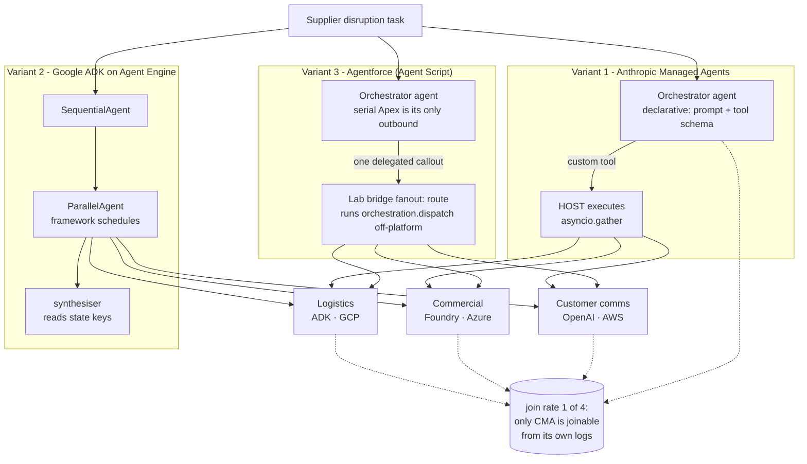
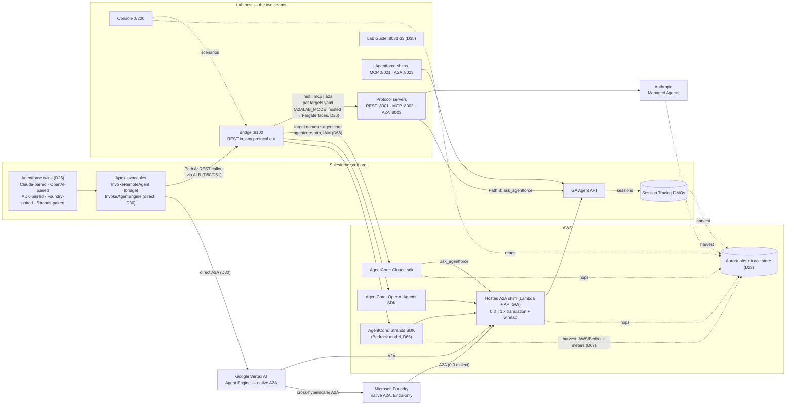
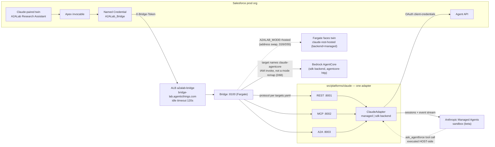
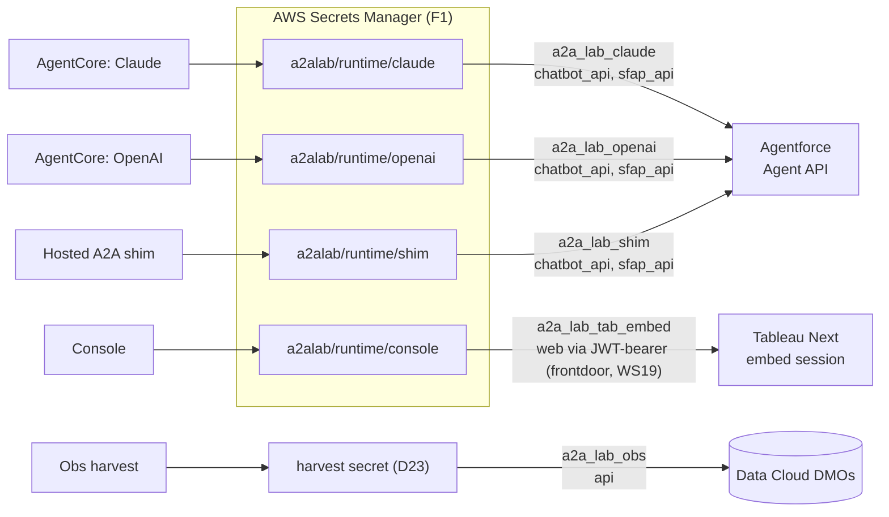

# A2A Interop Lab

Cross-platform agent-to-agent interoperability experiments across six
platforms — Salesforce **Agentforce**, Anthropic **Claude** (Managed Agents
and self-hosted SDK on Bedrock AgentCore), **OpenAI** (Agents SDK on
AgentCore), **Google ADK** (Gemini on Vertex AI Agent Engine),
**Microsoft Foundry** (gpt-5-mini on Foundry Agent Service), and **AWS
Strands** (Strands SDK on Bedrock AgentCore) — with each
direction runnable over platform-native REST, MCP, and the A2A protocol:
same scenario, same question, protocols compared side by side with the raw
wire payloads visible.

- **Plan & decisions:** [plan/](plan/) — decision log, architecture +
  protocol mapping rules, honest protocol matrix, results, runbooks.
- **Claude agent:** `src/platforms/claude/` — one adapter, two backends:
  Anthropic **Managed Agents (beta)** (default) and the self-hosted
  **Claude Agent SDK** (`CLAUDE_BACKEND=sdk`).
- **Agentforce:** `src/platforms/agentforce/` — GA Agent API client + MCP/A2A
  shims. The agent itself is authored in **Agent Script** (ADR D14): the
  authoring bundle in `salesforce/.../aiAuthoringBundles/` is the source of
  truth, published with `sf agent validate|publish|activate`. Account answers
  are grounded in real CRM records via an Apex action
  (`A2ALabGetAccountSummary` — Account + open Opportunities + Cases).
- **OpenAI agent:** `src/platforms/openai/` — OpenAI Agents SDK backend
  (gpt-5-mini, built by Codex under the D24 contract), self-hosted on
  Bedrock AgentCore alongside the Claude sdk twin.
- **Google ADK agent:** `src/platforms/adk/` — Gemini
  (gemini-2.5-flash-lite) on Vertex AI Agent Engine, the lab's first
  platform-native A2A endpoint; synthetic market-signals tool by default,
  live Google Search grounding behind `ADK_REAL_SEARCH=1`.
- **Microsoft Foundry agent:** `src/platforms/foundry/` — a prompt agent
  (gpt-5-mini) whose Agentforce consult happens PLATFORM-SIDE via
  Foundry's A2A tool against the lab's hosted shim; incoming A2A enabled
  (the second platform-native A2A endpoint, Entra-only). Provisioned by
  `deploy/foundry/provision_foundry.py`.
- **Lab Guide:** `src/platforms/guide/` (:8031–:8033) — the console's
  docent (D35): a Q&A agent grounded in the lab's own docs and ADR log,
  with read tools over the results, analyst briefs, and wire traces.
  Chat with it from the console header (🧭, streaming), or — the meta
  exhibit — call it over REST/MCP/A2A like any lab agent; its MCP server
  additionally exposes the raw read tools so the CALLING model can reason
  over lab data (Claude Desktop-ready, plan/04-runbooks.md §10).
- **Bridge:** `src/bridge/` — Agentforce's REST callout fans out to any
  target/protocol per `config/targets.yaml`; no Salesforce redeploy to switch.
- **Delegation guard:** `src/interop/delegation.py` (D27) — the lab wires both
  directions of every platform pair, which makes circular execution possible
  by construction. No agent protocol defines TTL/max-forwards semantics, so
  every seam stamps a versioned text **rider** (caller, platform, depth, trace
  id) plus machine-readable metadata, and refuses to forward past a depth
  limit. The rider is also the only correlation channel that survived every
  hop — structured ones were each dropped by at least one platform — so it
  doubles as provenance inside remote platforms' own logs.
- **Trace layer:** `src/interop/trace.py` — every hop records the **raw wire
  bytes** (MCP/A2A via ASGI wiretap, since the JSON-RPC envelopes live inside
  the frameworks), with a credential scrub before write. Sinks are pluggable:
  jsonl locally, Aurora Postgres for the hosted seams.
- **Honest matrix + insights:** [plan/02-matrix.md](plan/02-matrix.md) labels
  every cell native / via-bridge / via-shim / blocked-beta and refuses to
  claim more than the lab can back; `config/insights.yaml` is the distilled
  findings feed (console Insights section → `plan/08-insights.md`), each entry
  tagged measured / observed / hypothesis.
- **Lab console:** `src/console/` (:8200) — an experiment workspace styled
  after labs.agentforce.com (navy hero, gradient wordmark, experiment
  tiles with per-scenario call-path strips). The landing page explains the
  lab and its business cases; a collapsible **Control Panel** drawer
  (closed on first visit — landing navigation auto-opens it) holds
  Experiments (per-platform-pair groups), Observability (harvested
  platform logs + token/cost metrics), Insights, Protocol calls (single
  hops with per-cell "via bridge" toggles and answerable default
  prompts), and Traces. ADR references anywhere in the UI render as
  clickable decision chips (popover shows the decision's markdown); a
  runtime warm-up panel pre-warms the scale-to-zero containers and the
  hosted shim (D32). Pick a scenario, chat with it multi-turn (**Run**
  tab — each turn's live call-path diagram + raw wire hops beneath;
  platform-initiated legs are folded in by time correlation, errors are
  quoted per failing hop and auto-expanded), or study it first (**Details**
  tab: planned path, step-by-step narrative, live A2A agent cards, deep
  links to the real agent assets).
- **Salesforce consumption surface (D16):** the async pattern's briefs are
  first-class CRM records — `A2ALab_Account_Brief__c` under the Account,
  with an **Account Briefs** tab on the Account record page (LWC
  `a2alabAccountBriefs`: latest brief rendered from markdown in a
  scrollable pane + past-briefs list) and a dedicated brief record page
  (LWC `a2alabBriefViewer`) set as the object's default view. Each delivery
  also logs a completed Task on the Account (with a direct Lightning link
  to the brief) and fires the `A2ALab_Brief_Alert` in-app notification.
  Demo data: a real **Apple Inc.** account (apple.com, AAPL) with seeded
  opportunities/cases — the daily brief researches Apple, so the content
  is live real-world intel.

**Every experiment enters through the real designated agent on its own
platform, exactly as a human or API caller would** — it is then that
platform's job to initiate the cross-platform hop. Live experiment pairs
(each platform gets its own Agentforce twin, D25, so every pair stays a
closed two-platform system): **Claude Managed Agent ↔ Agentforce**,
**Claude (AWS/AgentCore) ↔ Agentforce**, **OpenAI (AWS) ↔ Agentforce**,
**Google ADK ↔ Agentforce** (with an operator-selectable direct-vs-bridge
route, D30), and **Microsoft Foundry ↔ Agentforce** — plus the async
**Account Intelligence Brief**. The originals in detail:

- **Claude → Agentforce** — Claude consults the Agentforce agent mid-answer
  for CRM truth (Path B).
- **Agentforce → Claude (sync)** — a true one-turn collaboration: you talk
  to the Agentforce agent over the GA Agent API; it answers from its own
  CRM records (Apex action over Account + Opportunities + Cases), then
  delegates outside-in market research to Claude through the Named
  Credential → tunnel → bridge, replying with both parts attributed
  ("From our CRM" / "External market research"). This is the protocol
  proof and the response-time measurement — the action-timeout chain is
  exactly what caps synchronous research depth.
- **Account Intelligence Brief (async, D16)** — the pattern Managed Agents
  is designed for: an Anthropic **scheduled deployment** (daily cron) fires
  a long-running research session (news, competitors, government
  relations, geopolitics via web tools), which delivers through a
  host-side custom tool into Salesforce — an `A2ALab_Account_Brief__c`
  record (long-text `Brief__c` on the Account, the Data 360 vector-search
  corpus that grounds the Agentforce agent's answers and sales plays, M10),
  a logged activity, and an in-app alert, all credited to the Claude
  managed agent. Provision once with `scripts/setup_brief_agent.py`.
  The cron-fired sessions STALL awaiting the host-side tool result, so
  something must be watching: `python -m briefs --watch`, hosted on
  Fargate since 2026-07-28 (`deploy/briefs/deploy_briefs.sh`, WS13 item
  3). It was the last runtime dependency on the operator's laptop.
  Nothing is lost while it is down — sessions idle and are picked up on
  the next poll.

## Fan-out orchestration — one task, three platforms, three orchestrators (WS8)

Every experiment above is **1:1** — one caller, one remote agent, one call
path. Real enterprises are not shaped like that. A disruption decomposes into
independent questions owned by different functions, and in any company of scale
those functions already run different agent platforms, chosen at different
times, by different business units.

So the lab's first **1:many** cell: one orchestrator dispatches a single
business task to three business-unit agents on three clouds *concurrently*,
then writes one brief.

**Scenario — supplier disruption.** A port strike halts container traffic
through Rotterdam. Within the hour someone needs to know which orders are
exposed, what the contracts say about penalties and force majeure, and what to
tell customers. Three questions, three owners, three platforms:

| Business unit | Agent | Platform |
|---|---|---|
| Logistics — exposure | `a2alab-logistics-agent` | Google ADK / Vertex AI Agent Engine |
| Commercial & Legal — contracts | `a2alab-commercial-agent` | Microsoft Foundry (gpt-5-mini) |
| Customer Operations — messaging | shared OpenAI runtime | OpenAI Agents SDK on Bedrock AgentCore |

Each leg is a **dedicated** agent, not the lab's general researchers — so each
platform's own logs attribute this experiment. The measured payoff: the
logistics agent answers in **2.5s against 39.8s** for the general researcher on
the same question, because it has no research toolset to reach for.

### The same scenario, orchestrated by three different platforms

The point of building it three times is that **the fan-out lives in a different
place on each platform** — one axis, who owns the concurrency:


```mermaid
flowchart TB
    T["Supplier disruption task"] --> C
    T --> A
    T --> AF

    subgraph cma["Variant 1 - Anthropic Managed Agents"]
        C["Orchestrator agent<br/>declarative: prompt + tool schema"]
        C -- "custom tool" --> H["HOST executes<br/>asyncio.gather"]
    end

    subgraph adk["Variant 2 - Google ADK on Agent Engine"]
        A["SequentialAgent"] --> P["ParallelAgent<br/>framework schedules"]
        P --> S["synthesiser<br/>reads state keys"]
    end

    subgraph af["Variant 3 - Agentforce (Agent Script)"]
        AF["Orchestrator agent<br/>serial Apex is its only outbound"]
        AF -- "one delegated callout" --> BR["Lab bridge fanout: route<br/>runs orchestration.dispatch off-platform"]
    end

    H --> L1
    H --> L2
    H --> L3
    P --> L1
    P --> L2
    P --> L3
    BR --> L1
    BR --> L2
    BR --> L3

    L1["Logistics<br/>ADK · GCP"]
    L2["Commercial<br/>Foundry · Azure"]
    L3["Customer comms<br/>OpenAI · AWS"]

    L1 -.-> OBS[("join rate 1 of 4:<br/>only CMA is joinable<br/>from its own logs")]
    L2 -.-> OBS
    L3 -.-> OBS
    C -.-> OBS
```

**Managed Agents gives you control at the seam; ADK gives you structure in the
graph; Agentforce has neither, so it delegates.** On Managed Agents the fan-out
is a `custom` tool, which means the *host* executes it: the model decides only
*when* to fan out, and your code owns concurrency, per-leg timeouts and the
partial-failure contract. On ADK the fan-out is *declared* — a `ParallelAgent`
of three sub-agents wrapped in a `SequentialAgent` — so the framework schedules
it and nothing calls back to a lab host at all. On **Agentforce** (authored in
Agent Script, D61) there is no host tool and no parallel graph: the only GA
outbound is a **serial** Apex callout, batch-capped at one inside a ~120s
transaction budget. So the orchestrator fans out by **delegating** — one Apex
callout to the bridge's `fanout:` route, which runs the same
`orchestration.dispatch()` off-platform. A selectable **serial** topology stacks
three ~110s callouts instead and overruns the budget by design — the constraint
*is* the finding.

None gives you all three. Host-side tools mean a rule enforced in code cannot be
talked out of by a model, but the orchestrator cannot run unattended. A declared
graph runs by itself and guarantees ordering, but the `[leg unavailable: …]`
markers survive only if three separate models relay them faithfully. And a
serial-outbound platform cannot fan out at all on its own — it participates in a
1:many topology only by handing the parallelism to a seam that has it.

### Partial failure is the normal case

A missing leg is **reported, never omitted**. Every leg gets a section whether
or not it answered, and every run carries a coverage line:

```
Customer operations (openai):
[leg unavailable: openai — TokenRetrievalError: Token has expired]

[fan-out coverage: 2/3 legs answered]
```

`scripts/run_fanout.py` exits non-zero on a partial run. This is deliberate: a
scheduled fan-out that returns a short brief with a success code is the
multi-agent form of an Agentforce action blowing its budget and returning HTTP
200 with its section heading present and the content silently gone — both
measured in this lab, a day apart.

### The join rate: 1 of 4

The number WS8 exists to produce. After a successful 3/3 run, how many of the
four platforms can be joined back to it **from their own execution logs**?

| Platform | Joined | Why |
|---|---|---|
| Anthropic CMA | ✅ | `platform_ref` = managed session id, stamped at emit |
| Google ADK | ❌ | **structural** — no per-turn session exists to join to |
| Microsoft Foundry | ❌ | **fixable** — emits a per-turn id the lab never records |
| OpenAI | ❌ | **fixable-ish** — lab records the AgentCore id, not the OpenAI one |

Every platform returned 200 and a good answer; the brief was complete; nothing
reported a problem. And afterwards three of four could not tell you they had
participated. **Cross-platform observability degrades silently, and it degrades
as the topology widens** — a 1:1 cell hides this because two platforms are easy
to correlate by hand.

Run it: `uv run python scripts/run_fanout.py --orchestrator cma`, then
`uv run python scripts/fanout_join_rate.py --latest`.

## Architecture

**The platform map** — five platforms, every pair a closed two-platform
system (D25). Solid edges are agent-to-agent calls; dotted edges are the
lab observing itself.


```mermaid
flowchart LR
    subgraph sforg["Salesforce prod org"]
        TWINS["Agentforce twins (D25)<br/>Claude-paired · OpenAI-paired<br/>ADK-paired · Foundry-paired · Strands-paired"]
        APEX["Apex invocables<br/>InvokeRemoteAgent (bridge)<br/>InvokeAgentEngine (direct, D30)"]
        AGENTAPI["GA Agent API"]
        STDM[("Session Tracing DMOs")]
        TWINS --> APEX
        AGENTAPI -. sessions .-> STDM
    end

    subgraph lab["Lab host — the two seams"]
        BR["Bridge :8100<br/>REST in, any protocol out"]
        SRV["Protocol servers<br/>REST :8001 · MCP :8002 · A2A :8003"]
        GUIDE["Lab Guide :8031-33 (D35)"]
        SHIMS["Agentforce shims<br/>MCP :8021 · A2A :8023"]
        CONSOLE["Console :8200"]
    end

    subgraph aws["AWS"]
        ACC["AgentCore: Claude sdk"]
        ACO["AgentCore: OpenAI Agents SDK"]
        ACS["AgentCore: Strands SDK<br/>(Bedrock model, D66)"]
        HSHIM["Hosted A2A shim (Lambda + API GW)<br/>0.3↔1.x translation + wiretap"]
        OBSDB[("Aurora obs + trace store (D23)")]
    end

    CMA["Anthropic<br/>Managed Agents"]
    ADK["Google Vertex AI<br/>Agent Engine — native A2A"]
    FDY["Microsoft Foundry<br/>native A2A, Entra-only"]

    APEX -- "Path A: REST callout<br/>via ALB (D50/D51)" --> BR
    APEX -- "direct A2A (D30)" --> ADK
    BR -- "rest | mcp | a2a<br/>per targets.yaml<br/>(A2ALAB_MODE=hosted → Fargate faces, D26)" --> SRV
    BR -- "target names *-agentcore<br/>agentcore-http, IAM (D68)" --> ACC
    BR --> ACO
    BR --> ACS
    SRV --> CMA
    SRV -- "Path B: ask_agentforce" --> AGENTAPI
    SHIMS --> AGENTAPI
    ACC -- ask_agentforce --> HSHIM
    ACO --> HSHIM
    ACS --> HSHIM
    ADK -- A2A --> HSHIM
    FDY -- "A2A (0.3 dialect)" --> HSHIM
    ADK -- "cross-hyperscaler A2A" --> FDY
    HSHIM --> AGENTAPI
    CONSOLE -.scenarios.-> BR
    CONSOLE -.reads.-> OBSDB
    HSHIM -.hops.-> OBSDB
    ACC -.hops.-> OBSDB
    STDM -.harvest.-> OBSDB
    CMA -.harvest.-> OBSDB
    ACS -. "harvest: AWS/Bedrock meters (D67)" .-> OBSDB
```

**One pair in detail** — the Claude ↔ Agentforce originals, both
directions, with the local/hosted switch:


```mermaid
flowchart LR
    subgraph sforg["Salesforce prod org"]
        AF["Claude-paired twin<br/>A2ALab Research Assistant"]
        APEX["Apex invocable"]
        NC["Named Credential<br/>A2ALab_Bridge"]
        AGENTAPI["Agent API"]
        AF --> APEX --> NC
    end

    ALB["ALB a2alab-bridge<br/>bridge-lab.agenticthings.com<br/>idle timeout 120s"]
    BR["Bridge :8100 (Fargate)"]

    subgraph claude["src/platforms/claude — one adapter"]
        REST["REST :8001"]
        MCP["MCP :8002"]
        A2A["A2A :8003"]
        ADAPTER["ClaudeAdapter<br/>managed | sdk backend"]
        REST --> ADAPTER
        MCP --> ADAPTER
        A2A --> ADAPTER
    end

    CMA["Anthropic Managed Agents<br/>sandbox (beta)"]
    FACES["Fargate faces twin<br/>claude-rest-hosted (backend=managed)"]
    ACC["Bedrock AgentCore<br/>(sdk backend, agentcore-http)"]

    NC -- "X-Bridge-Token" --> ALB --> BR
    BR -- "protocol per targets.yaml" --> REST
    BR --> MCP
    BR --> A2A
    BR -. "A2ALAB_MODE=hosted<br/>(address swap, D26/D55)" .-> FACES
    BR -- "target names claude-agentcore<br/>IAM invoke, not a mode remap (D68)" --> ACC
    ADAPTER -- "sessions + event stream" --> CMA
    CMA -. "ask_agentforce tool call<br/>executed HOST-side" .-> ADAPTER
    ADAPTER -- "OAuth client-credentials" --> AGENTAPI
```

The stack hangs off two seams sharing the canonical `AgentRequest`/`AgentResponse`
models (`src/interop/models.py`):

- **Inbound** (`interop.adapter.AgentAdapter`) — an agent we host implements
  `handle()` once and `serve()` mounts it behind REST, MCP, or A2A. That's how
  the one Claude adapter shows up on ports 8001–8003, and how the Agentforce
  proxy adapter becomes the MCP/A2A shims on 8021/8023.
- **Outbound** (`interop.clients.RemoteAgentClient`) — one client per protocol
  plus the platform-native `AgentforceClient`, resolved by target name via
  `config/targets.yaml`.

**Path A** (Agentforce → Claude): the agent's custom action invokes Apex, which
POSTs through the Named Credential and tunnel to the bridge; the bridge fans
out to the chosen target/protocol. Switching Path A from REST to MCP to A2A is
a `targets.yaml` edit — no Salesforce redeploy.

**Path B** (Claude → Agentforce): the Claude agent declares an
`ask_agentforce` tool. Under the managed backend the tool call surfaces in the
event stream and is executed **host-side** by `AgentforceClient`; the sandbox
never sees Salesforce credentials. The via-shim cells (any MCP/A2A client →
shim → Agent API) cover the same direction for protocol comparison.

### Bridge vs shims — the two adapters around Agentforce

They solve opposite halves of the same problem: Agentforce can't speak the
lab's protocols in either direction. The **bridge** fixes its *outbound* gap;
the **shims** fix its *inbound* gap.

- **Bridge (:8100) — REST in, any protocol out.** Agentforce's only outbound
  is a REST callout from Apex; it cannot originate an MCP or A2A call, and
  hard-coding endpoints in Apex would mean a Salesforce deploy per change. So
  the twin's action always makes one simple POST to the bridge, and the
  bridge fans out to any target over any protocol per `config/targets.yaml`.
  As a lab component it also records every hop — that's the "via bridge
  (traced)" route, and why D30's *direct* route exists as its counterpoint
  (skip the bridge, gain independence, lose the trace).
- **Shims (:8021/:8023 + the hosted Lambda, D28) — MCP/A2A in, Agent API
  out.** External agents that want to reach Agentforce over MCP or A2A can't:
  Salesforce exposes no GA inbound surface for either. The shim speaks the
  protocol on Salesforce's behalf — a real MCP or A2A endpoint, agent card
  and all — and proxies each call to the Agent API underneath. Those matrix
  cells are honestly `via-shim`, never `native`: the protocol conversation is
  with the lab's proxy, not the platform.

Mnemonic: **the bridge lets Agentforce call the world; the shims let the
world call Agentforce.** And a nuance worth keeping straight: the
Claude/OpenAI protocol servers (:8001–:8013) look shim-like but aren't shims
— there's no platform being proxied. The lab hosts those agents itself, so
its servers are the agents' own front door (which is why those cells count
as native). A shim specifically means a protocol face bolted onto someone
else's closed platform.

Every hop records a `TraceEvent` with the raw wire bytes (REST at handler
level; MCP/A2A via the WireTap ASGI middleware, since the JSON-RPC envelopes
live inside the frameworks). Where events go is pluggable (ADR D13/D19,
`A2ALAB_TRACE_SINK`, default `jsonl,sqlite`): JSONL files under `traces/` are
the append-only raw archive, `traces/lab.db` (SQLite) is the console's query
path, and a DynamoDB table covers cloud deploys — also the integration point
for Data 360's zero-copy connector → TableauNext reporting (M10). The console
groups events by trace id, which rides `X-Trace-Id` on REST, a tool argument
on MCP, and `metadata.trace_id` on A2A. Each hop additionally records a
`platform_ref` — the *platform-native* execution id (CMA session id, Agent
API/STDM session id) — stamped at emit time.

**Public exposure** (D20, WS13): a free-plan Cloudflare account holds DNS for
the whole `agenticthings.com` zone under stable single-level hostnames
(single-level because free Universal SSL covers only one subdomain label). As
of WS13 (2026-07-28) the hosted components are published as Cloudflare-**proxied**
(orange) CNAMEs fronting the shared ALB `a2alab-bridge` — TLS terminates at the
Cloudflare edge, Full (strict) to the ALB's imported `*.agenticthings.com`
origin cert — for `bridge-lab`, `console-lab` and `faces-lab`. The named
`cloudflared` tunnel (outbound-only, HTTP/2) still runs but is **re-scoped to
local development**, fronting only the `claude-{rest,mcp,a2a}-lab` hostnames
(`run_local.sh`). Stable hostnames mean the Salesforce Named Credential is
configured once and survives both edge and tunnel restarts.

**Observability** (M11, `plan/05-observability.md`): a dedicated console
section shows each *platform's interior view* of the runs the lab drove,
next to the lab's own wire traces. Harvesters (`src/observability/`,
`scripts/obs_harvest.py`, or the console's Harvest button) pull Claude
Managed Agents sessions/events (thinking, tool calls, token usage) and
Salesforce Session Tracing DMOs into `lab.db`; `platform_ref` joins the two
views per execution. The coverage panel renders the honest per-platform
capability matrix live — including what each platform does *not* expose
(OpenAI's traces are write-only; that gap is a finding). One layer up
(D22), an optional **observability analyst** — a managed Claude agent with a
single read-only SQL tool (`scripts/setup_obs_analyst.py --run`) —
interprets the harvested store and writes findings briefs to
`traces/obs-briefs/`; the pull itself stays deterministic ETL.

**Coding Agents Telemetry** (WS9, its own console section): the lab measuring
its own construction. Claude Code and the Codex CLI both export OpenTelemetry,
and CloudWatch ingests OTLP on a managed endpoint — no collector — so
`src/observability/coding_source.py` reads their metrics back through the same
harvest seam every platform uses, behind that section's own **Harvest** button.
Deliberately *not* a column in the Observability coverage panel: every
column there is an agent platform whose interior the lab harvests, and the tool
that BUILT the lab is not one of those.

The section's value is the honest comparison, because the two agents do **not**
emit the same shapes. Claude Code publishes `cost.usage` in USD and a token Sum;
Codex publishes no cost metric at all and a token *histogram*, so its models are
counted in sessions and turns. Cost is stated as **modelled at list price** — a
client-side estimate, not an invoice. Two attribution findings are baked into
the read path: `model` is a datapoint label on both tools already, while
**neither** emits anything naming the project or repository, so per-codebase cost
is configuration you add (`OTEL_RESOURCE_ATTRIBUTES` per checkout, a launch
wrapper for Codex) — and because those values are unvalidated free text, a repo
left on the docs placeholder silently becomes a second codebase, which
`normalize_repos()` folds back. CloudWatch cannot delete datapoints, so every
such fix lives on the read side.

**Tokens are reported in four buckets, never one** (D44). The API bills uncached
input, cache reads, cache writes and output separately, at roughly 1x, 0.1x,
1.25–2x and the output rate — so they cannot be summed and multiplied by a rate.
`input_tokens` is the *uncached remainder*, not the prompt, and treating it as
"input" had this dashboard reporting 120K tokens for a day that processed 4.42M:
a 36x understatement that raised no error and looked entirely plausible. The
section now shows four tiles and a composition bar, and the reason they are
separate travels in the API payload.

Above the tables sits the **cost sentinel** (WS12) — a daily scheduled Managed
Agent that reads this store through the obs MCP server and explains what
*moved*, since the tables already report what it *was*. It is the counter-example
to the credential analyst, which was deliberately demoted to a plain API call:
the sentinel passes all three tests that one failed (it needs tools — the delta
is a SQL question; it can genuinely be scheduled — collection runs in the harvest
Lambda, not on a laptop; and it needs state — week-over-week needs history).
Created **paused**, because a firing bills a real session. Its first firing
(2026-07-28) did the thing it was built for: it **refused** the week-over-week
comparison as too thin rather than inventing one, attributed the day-over-day
move to session count on the same repo and model, and — unprompted — flagged a
CloudWatch permission gap in its own input. The framing behind all of this,
written for a presales conversation, is
`build-notes/claude/10-consumption-and-list-price.md`.

Getting it from code-complete to running produced **D46**: four separate ways an
artifact can be built and never deployed, every one of which reported success. A
zip nobody pushed, a schema migration whose only caller lacked the privilege to
run it, a backfill that could not write since a credential split, and a
permission that existed as a comment rather than a policy. The rule that came
out of it — *a build step that produces an artifact must also own shipping it* —
is D37's "config no script owns is config nobody updates", reaching build
artifacts and database schema.

## The A2A implementation

The lab speaks the formal [A2A protocol](https://github.com/a2aproject/A2A)
via the official `a2a-sdk` (the a2aproject reference Python implementation) —
JSON-RPC binding, AgentCard discovery, and the full Task lifecycle. But
**Agentforce never speaks A2A itself**: on every "a2a" cell in the matrix, at
least one end of the A2A hop is code this lab hosts. Three distinct
situations hide behind the one protocol label:

| Cell | Who speaks A2A | Status |
|---|---|---|
| `claude-a2a` (:8003) | both ends — our client ↔ our a2a-sdk server | native |
| `google-adk-a2a` | the PLATFORM speaks A2A (Vertex AI Agent Engine's own endpoint, IAM bearer) | native |
| `foundry-a2a` | the PLATFORM speaks A2A (Foundry Agent Service incoming A2A, Entra-only) | native |
| Path A "A2A" | only the bridge's `A2AClient`; Agentforce reaches it via a plain REST callout | via-bridge |
| `agentforce-a2a` (:8023) | only our shim, which proxies inbound A2A to the GA Agent API | via-shim |
| Agentforce → A2A native | nobody — Agentforce has no A2A client or server surface | blocked |

One exchange (`src/interop/servers/a2a.py`, `src/interop/clients/a2a.py`):

1. The client fetches `/.well-known/agent-card.json` — anonymously, since the
   spec requires open discovery (this path is exempt from token auth).
2. The client POSTs a JSON-RPC `message/send` carrying a
   `Message{role: user, parts: [text], contextId, metadata.trace_id}`.
3. The server's `AdapterExecutor` walks the Task lifecycle:
   `submitted` → `working` → text artifact named `answer` → `completed`.
   Failures become a `failed` Task with the error in the status message —
   not an HTTP error.
4. The client reads the completed Task's artifact text as the answer.

**The AgentCard is not a file in the repo** — `build_agent_card()`
(`src/interop/servers/a2a.py`) constructs it at startup from the mounted
adapter's `name`/`description`, so the Claude server (:8003) and the
Agentforce shim (:8023) each publish their own card from the same code. Fetch
one live: `curl http://localhost:8003/.well-known/agent-card.json`.

Protocol-mapping rules (plan/01-architecture.md): A2A `contextId` ↔ lab
`session_id`, `trace_id` rides in message `metadata`, answer = one completed
Task with one text artifact. A finding from the matrix ledger: A2A is the
only protocol of the three where the conversation id is first-class on the
wire — REST and MCP both smuggle it as an argument.

Two implementation notes:

- The a2a-sdk owns the JSON-RPC envelopes internally, so handlers never see
  raw bytes — the WireTap ASGI middleware captures them for the trace layer.
  A2A hops in the console show the actual wire JSON-RPC, not a reconstruction.
- The agent card advertises `streaming: true`, but the lab client runs
  `ClientConfig(streaming=False)`: streaming is out of scope for v1 (Apex
  callouts are buffered). D11 scoped one SSE demo as a capability comparison
  and it was never built — a declared capability the lab has not exercised.
- **The asynchronous half of A2A is now exercised, and it was one unset field**
  (D47). `SendMessage` MUST return immediately and processing MAY continue
  after; the lab had implemented that lifecycle and driven it synchronously for
  months, because `configuration.return_immediately` was never set. Setting it
  took the hosted Agentforce shim from work bounded by API Gateway's 29s
  integration timeout to **31.1 seconds of work completed behind it, with a
  longest single request of 1.18s**. Support is uneven and only measurement
  shows it: Azure Foundry implements the async half, while Vertex AI Agent
  Engine returns a task id in 826ms that no request shape reads back. And on a
  scale-to-zero runtime the polling *is* the compute — submit then stay quiet
  for 45s and the task is still WORKING, because Lambda freezes between
  invocations. Numbers in `plan/03-results.md`.

### The A2A version spectrum — and the lab's compatibility layer

"Speaks A2A" spans protocol generations, measured live: Vertex AI Agent
Engine **requires** `a2a-version: 1.0` (rejects the 0.3 default with
VERSION_NOT_SUPPORTED), while Microsoft Foundry's A2A tool **speaks the
0.3 dialect** — it rejects a pure 1.x agent card (missing
`url`/`protocolVersion`/`preferredTransport`) and sends 0.3 JSON-RPC
(`message/send`, `kind`-discriminated parts) that a 1.x server answers
with `-32601`. Neither negotiates. Every lab A2A server is therefore
**bilingual**: the served card carries both generations' fields
(`servers/a2a.py`), and `servers/a2a_compat.py` translates 0.3 requests
to the 1.x envelope and the completed Task back — 1.x traffic passes
through untouched. The hosted shim additionally runs the WireTap under
Lambda (buffer-and-replay receive), so the **raw inbound envelope** —
including Foundry's actual 0.3 bytes with the model-composed D27 rider —
lands in the Aurora trace store, source-labeled by the rider's
caller-platform (`foundry → agentforce-a2a-shim → agentforce` in the
console's merged call path).

## Security model, hop by hop

Two shared secrets protect everything we host, because the Cloudflare tunnel
publishes these apps on the open internet and the tunnel edge itself does
**no** auth — each app enforces its own:

| Secret | Protects | Sent as |
|---|---|---|
| `BRIDGE_TOKEN` | bridge :8100 | `X-Bridge-Token` header |
| `A2ALAB_TOKEN` | protocol servers :8001–8003, shims :8021/:8023, console :8200 | `X-Lab-Token`, `Authorization: Bearer` |

Either token **unset = auth skipped** — pass-through is for localhost dev
only. Set both in `.env` before running `cloudflared`, or the endpoints (and
the raw payloads in the console) are open to anyone. Those are **service**
credentials; the console's browser surface additionally requires a **user**
sign-in (operator/viewer personas, D36) with server-side role gating, and
credentials in query strings are rejected outright — the SSE live tail uses
fetch-streaming precisely so no token ever rides a URL.

### Who authenticates as what

Every hosted seam holds its own credentials and its own Salesforce identity
— no shared runtime env vars, no shared integration app (D37):


```mermaid
flowchart LR
    subgraph sm["AWS Secrets Manager (F1)"]
        SC["a2alab/runtime/claude"]
        SO["a2alab/runtime/openai"]
        SS["a2alab/runtime/shim"]
        SCON["a2alab/runtime/console"]
    end

    ACC["AgentCore: Claude"] --> SC
    ACO["AgentCore: OpenAI"] --> SO
    HSHIM["Hosted A2A shim"] --> SS
    CON["Console"] --> SCON
    HARV["Obs harvest"] --> SH["harvest secret (D23)"]

    SC -- "a2a_lab_claude<br/>chatbot_api, sfap_api" --> AAPI["Agentforce<br/>Agent API"]
    SO -- "a2a_lab_openai<br/>chatbot_api, sfap_api" --> AAPI
    SS -- "a2a_lab_shim<br/>chatbot_api, sfap_api" --> AAPI
    SH -- "a2a_lab_obs<br/>api" --> DMO[("Data Cloud DMOs")]
    SCON -- "a2a_lab_tab_embed<br/>web via JWT-bearer (frontdoor, WS19)" --> TAB["Tableau Next<br/>embed session"]
```

Runtime configs carry only the secret's **ARN**; `interop.secret_env` resolves
it at container start, and a failed fetch refuses to boot rather than running
credential-less. Nothing in a runtime description is a credential.

Two things the scope split does NOT show, both learned the expensive way: an
External Client App must also enable **JWT-based access tokens** before the
Agent API will serve it (without that flag every call 404s while the app
authenticates perfectly), and there is **no step linking an app to an agent**
— authorization is the token's scopes plus the agent id. `uv run python
scripts/identity_preflight.py` proves each identity by exercising its actual
capability, which is the only check that would have caught either.

**The finding behind the split** (D37): the shared app's grant looked bloated,
but it was the *union* of four callers' needs — every scope on it was load
bearing for somebody. `refresh_token` was genuinely dead and dropped; `api`
was needed by exactly one caller (the harvest's Data Cloud reads) and is kept
deliberately. Shrinking the rest took **splitting the identity**, not editing
the scope list: the three agent callers now hold no `api` scope at all, and
Salesforce login history finally attributes each caller by its own app.
Least privilege was an identity-modelling problem wearing a
scope-configuration costume.

### Tokens — what is configured where

| Secret | Lab host (this repo) | Salesforce org (a2alab-prod) | Cloud |
|---|---|---|---|
| `BRIDGE_TOKEN` | `.env` — the bridge enforces it on every `/invoke` | Stored as parameter `BridgeToken` on Named Principal **A2ALabPrincipal** of External Credential **A2ALab_Bridge** (set via the Connect API `named-credentials/credential`, or Setup → Named Credentials → External Credentials — never in metadata or git). The Named Credential `A2ALab_Bridge` merges it into the `X-Bridge-Token` header at callout time; the bot user gets principal access via the `A2ALab_Agent_Actions` permission set | — |
| `A2ALAB_TOKEN` | `.env` — enforced by servers/shims/console; clients send it per `config/targets.yaml` `auth:` blocks | — | rides to hosted runtimes as `AF_SHIM_TOKEN` (setting `A2ALAB_TOKEN` in a runtime would switch on its own inbound auth, which `invoke_agent_runtime` cannot satisfy) |
| `ANTHROPIC_API_KEY` / `OPENAI_API_KEY` | `.env` — used host-side only; the managed sandbox never holds it | — | in the per-runtime Secrets Manager secret, never in the runtime env |
| `SF_CLIENT_ID` / `SF_CLIENT_SECRET` | `.env` — the shared `a2a_lab_app`, the **local-development** identity | Consumer key/secret of the org's External Client App | — |
| `SF_CLIENT_ID_<SEAM>` / `SF_CLIENT_SECRET_<SEAM>` | `.env` — per-caller apps (`CLAUDE`, `OPENAI`, `SHIM`, `OBS`); the deploy scripts ship each pair into that seam's own secret, falling back to the shared app when unset | Four per-caller External Client Apps, each scoped to what that caller actually calls | — |

The Named Credential points at the stable named tunnel
`bridge-lab.agenticthings.com` (D20 — single-level hostname on the free
Cloudflare plan), so tunnel restarts need no redeploy.

### `.env` is a secret too — and the repo names no accounts

Every row above says "`.env`", which for a long time meant *a plaintext file on
one laptop*. D39 requires each credential to be a service identity fetched with
the single human AWS login; `.env` was the one file still breaking that rule.
Losing it would not lose the code — it would lose the ability to run or deploy
it, which across five clouds is most of the value.

**`.env` now lives in AWS Secrets Manager** and moves with
`uv run python scripts/env_sync.py pull | push | diff`. Onboarding is **clone →
`aws sso login` → `env_sync.py pull`**. `.env.example` stays the checked-in
contract naming every key and what it is for; only the *values* live in the
secret, released to identities its IAM policy already admits. That is the
difference between sharing secrets with a team and pasting them into a message.

The sync refuses in the ways that matter: `pull` will not overwrite a diverged
`.env` without `--force` and always keeps a timestamped backup; `push` will not
drop keys the secret already has; `diff` reports key **names** and which side is
ahead, never values.

Two rules keep the repo itself safe to publish:

- **No environment identifier is hardcoded anywhere** — no cloud account ids,
  project ids, subscription names, or SSO profile names, and no
  `${VAR:-default}` fallbacks, which are hardcodes that only surface on someone
  else's machine. Docs name **regions**, because a region is what a reader needs
  to reason about latency and residency, while an account identifies whose cloud
  it is and who pays for it. A test fails the build if an AWS account id or
  profile name reappears in a tracked file.
- **Every AWS deploy proves its target account before creating anything.**
  `deploy/aws_preflight.sh` resolves the live session with
  `sts get-caller-identity` and refuses unless it matches
  `A2ALAB_AWS_ACCOUNT_ID`. Taking the account name out of the repo makes a
  wrong-account deploy *easier* to attempt, so the guard shipped with the scrub
  rather than after it — and it is enforced by a test that requires any deploy
  script calling the AWS CLI to source it.
- **The console's public surface names no accounts.** `/api/scenarios` and
  `/api/targets` are unauthenticated — the landing exhibit renders from them —
  and they carried the vendor console deep links, which is exactly where an org
  my-domain, a GCP project id or an Azure tenant id lives. Anonymous callers get
  the component titles, notes and screenshots; the links resolve only when
  signed in. The general lesson is worth more than the fix: **a repo scrub is
  not a boundary.** These identifiers were assembled at runtime from `.env`, so
  removing them from source left them being served anyway — anything derived
  from configuration has to be checked at the edge it is served from (D43).

1. **Agentforce → Apex** — stays inside the org. The custom action runs as the
   org's integration user; access to the callout credential is granted via
   permission set.
2. **Apex → bridge** — the Named Credential `A2ALab_Bridge` (a
   `SecuredEndpoint` with `generateAuthorizationHeader=false`) merges
   `{!$Credential.A2ALab_Bridge.BridgeToken}` into the `X-Bridge-Token`
   header at callout time. The token value lives on a Named Principal of the
   custom External Credential — set once in Setup, never in Apex, metadata,
   or git. TLS terminates at the Cloudflare edge; `cloudflared` connects
   outbound from the lab host, so no inbound port is ever opened.
3. **Bridge → protocol servers** — each target's `auth:` block in
   `config/targets.yaml` (with `${A2ALAB_TOKEN}` expanded from the
   environment) tells the client what to send; the servers are wrapped in
   `TokenAuthMiddleware` (`src/interop/servers/auth.py`). Exempt paths:
   `/healthz`, `/ping`, and `/.well-known/agent-card.json` — A2A clients must
   be able to fetch the agent card anonymously.
4. **Claude adapter → Anthropic** — `ANTHROPIC_API_KEY` is used host-side
   only. The managed sandbox holds no credentials at all: when the agent
   wants Agentforce (Path B), the `ask_agentforce` custom tool is executed on
   our side of the event stream, and only the tool *result* goes back in.
5. **Lab host / hosted seams → Agent API** (Path B and the shims) — OAuth 2.0
   client-credentials against an External Client App, bearer token cached
   until expiry, HTTPS to `api.salesforce.com`. Which app depends on the
   caller (D37/F6): each hosted seam presents its own, scoped to the Agent
   API alone; local development presents the shared `a2a_lab_app`. The shims
   add no secrets of their own — inbound `A2ALAB_TOKEN`, outbound OAuth.
6. **Delegation between agents** — every delegated request carries the D27
   rider (a delimited, versioned `[A2A-LAB DELEGATION]` block naming the
   caller, platform, depth, and trace id) plus machine-readable
   `metadata["delegation"]`, and every seam refuses to forward past
   `A2ALAB_MAX_DELEGATION_DEPTH`. That is what stops two mutually-wired
   agents from looping — none of REST, MCP, or A2A defines TTL semantics, so
   the lab supplies its own. New delegation paths must route through
   `interop.delegation`.
7. **Browser → console** — `A2ALAB_TOKEN` for service callers; browsers sign
   in as a persona (D36) and a server-side role gate decides what each role
   may do (the UI hides what a role can't do, but the 403 is the guard).
   Only `/` (the static shell) and the landing page are exempt.
8. **Trace storage** — traces hold complete raw request/response payloads by
   design, because the wire record IS the exhibit. What they do *not* hold is
   credentials: a scrub pass (F2) redacts bearer tokens, `access_token`,
   `client_secret`, and `sk-…` keys at the sink layer, before anything is
   written. The JSONL files (`traces/*.jsonl`) are gitignored and never leave
   the lab host. `.env` and `.a2alab/` are gitignored too, but *do* leave it —
   `.env` to Secrets Manager (D43) and the secret-bearing half of `.a2alab/` to
   a private dotfiles repo, age-encrypted at rest (D45). Both are deliberate:
   one copy on one laptop is not a security property. The hosted seams write hops
   to the Aurora store (D23) over the RDS Data API, where the secret ARN *is*
   the role selection. A DynamoDB sink (D13) still exists and is superseded
   by the Postgres path for cloud runs.

## Quick start (local loopback — no external accounts)

```sh
uv sync
uv run pytest                      # unit + loopback e2e (echo agent over rest/mcp/a2a)
```

## With credentials

```sh
cp .env.example .env               # fill in what you have
uv run python scripts/setup_managed_agent.py   # once: provisions the CMA agent
scripts/run_local.sh               # full local stack
uv run python scripts/matrix.py    # run every runnable protocol cell
open http://localhost:8200         # lab console
uv run python scripts/sf_smoke.py  # Agentforce go/no-go (needs SF_* in .env)
```

## Where it actually runs (WS13)

**The lab no longer needs the laptop at runtime.** `run_local.sh` above is a
development convenience, not the deployment — as of 2026-07-28 every runtime
component is hosted, and the laptop is a *deploy-time* credential only. Hosting
does not remove the AWS login and should not: you authenticate to push changes,
and once deployed nothing needs a live session for the lab to keep working.

| Component | Where | Deployed by |
|---|---|---|
| Path A bridge | ECS Fargate + ALB | `deploy/bridge/deploy_bridge.sh` |
| Lab console | ECS Fargate, host-header rule on the same ALB | `deploy/console/deploy_console.sh` |
| The fourteen protocol faces | ECS Fargate, **one process**, addressed by path | `deploy/faces/deploy_faces.sh` |
| Claude + OpenAI SDK agents | Bedrock AgentCore (IAM data plane, no URL) | `deploy/agentcore/deploy.sh` |
| Agentforce A2A shim, fan-out MCP, obs harvest + obs MCP | Lambda | `deploy/shim/`, `deploy/fanout/`, `deploy/obs/` |
| ADK agents | Vertex AI Agent Engine | `deploy/adk/deploy_adk.py` |
| Foundry agents | Azure AI Foundry | `deploy/foundry/provision_foundry.py` |

Three hostnames — the bridge, the console and the faces — are CNAMEs at the
**same** ALB, which terminates TLS with one wildcard origin certificate. A new
face costs a listener rule and a target group, not a load balancer. The
`cloudflared` tunnel still runs, re-scoped to local development.

`A2ALAB_MODE=hosted` swaps every `localhost` target for its hosted twin, so the
same console, the same adapters and the same protocol comparison run either way
— which is the point: a face that behaved differently hosted would make the
comparison meaningless.

**What the map is:** [plan/09-deployment-map.md](plan/09-deployment-map.md) —
what is deployed, where, and why there, including the four DNS records (L5.5)
and the file→deployment table (L6). The console's Architecture section renders
it live.

**Running it once deployed:** [plan/10-operations.md](plan/10-operations.md) — rotating the console passwords
and the JWT keypair, which deploys need a rebuild and which do not, moving the
brief watcher, and the ordered list to work down when the console looks broken.

Milestone status and next steps: see plan/00-decisions.md and plan/02-matrix.md.
