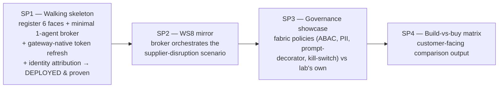
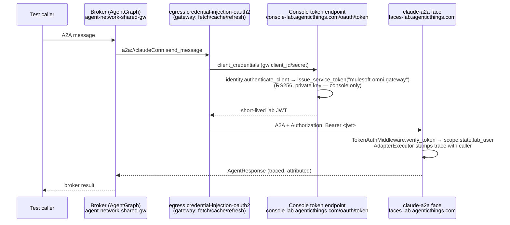

# MuleSoft Agent Fabric — Broker + Registration design (WS10)

**Date:** 2026-08-31
**Workstream:** WS10 (`plan/07-workstreams.md`) — build-vs-buy comparison of the lab's
hand-built A2A/MCP interop against MuleSoft's **Agent Fabric** (Agent Broker + Omni
Gateway + trusted registry).
**Companion records:** `plan/15-mulesoft-agent-fabric-gateway-blocker.md` (gateway build
record, now RESOLVED), auto-memory `ws10-mulesoft-agent-fabric-setup`.
**Status of prerequisites:** Omni Gateway `agent-network-shared-gw` provisioned and
RUNNING on `cloudhub-us-east-1` (managed, `large`), currently in the **Design**
environment. The move to **Production** is an operator-run CLI step (see §7) and is a
prerequisite for the production build, not part of the authored deliverable.

---

## 1. What this builds and why

WS10 asks a single question in the lab's own idiom: **when you already have a working
hand-built A2A/MCP mesh, what does buying MuleSoft's Agent Fabric add, and what does it
cost?** The only honest way to answer is to stand the fabric up against the *same*
agents the lab already exposes and compare the two side by side — the same discipline
the rest of the lab applies to REST vs MCP vs A2A.

Concretely: register the lab's existing hosted A2A "faces" as external agents in a
MuleSoft agent-network, deploy an Agent Broker on the Omni Gateway that orchestrates
them, route the broker's egress through the gateway with a real lab identity, and record
what the fabric gives us for free (identity token acquisition + refresh, governance
policies, a trusted registry, telemetry) versus what it constrains (single-gateway
shared-space `large`-only sizing, the AgentScript authoring model, deploy-time secret
handling).

This is **architectural** work: a new subsystem (`mulesoft/`) and a new inbound seam on
the console (a token endpoint). It follows the lab's standing conventions — no account
identifiers anywhere, secrets via the established stores, deployment-map and console
copy updated in the same change as the architecture, and the delivery record written as
item lines so `jira_sync.py` (D58/D60) imports it.

## 2. Decomposition and sequence

The work is four sub-projects, built in order. Each is independently valuable and
de-risks the next; each gets its own plan → implementation cycle. This spec details
**SP1** and outlines SP2–SP4.



**Why walking-skeleton-first.** SP1 registers all six agents but drives only a
single-hop broker, so the first deploy flushes out the genuine unknowns — the AF build
toolchain, the AgentGraph deploy onto CloudHub 2.0, gateway-native OAuth2 token
acquisition against a real lab endpoint, and identity attribution through the trace
layer — before any investment in orchestration graphs or governance policies. Nothing in
SP2–SP4 is worth authoring until the pipeline is proven end-to-end once.

## 3. Grounding — what the code and platform actually support

Every design choice below is grounded in verified fact, not assumption:

- **The faces already verify lab JWTs.** `TokenAuthMiddleware` (`src/interop/servers/auth.py`)
  wraps every face (`src/interop/adapter.py:53`). If a presented credential is not the
  shared `A2ALAB_TOKEN` but "looks like a JWT" (`eyJ…`, two dots — `identity.py:236`), it
  calls `verify_token` and, on a valid `iss=a2a-lab` RS256 token, admits the request and
  stashes claims at `scope["state"]["lab_user"]` (`auth.py:91-101`). **No auth-middleware
  change is needed** for the gateway to get in with a lab JWT.
- **RS256 is asymmetric by design.** The private key mints; verifiers (the faces /
  containers) hold only the public key and can never mint (`identity.py:9-13`). This is a
  hard invariant: the token-minting endpoint **cannot** live on the faces.
- **The A2A face discards the caller identity today.** `AdapterExecutor.execute`
  (`src/interop/servers/a2a.py:68-99`) derives its request purely from A2A message
  metadata and never reads `scope["state"]["lab_user"]`. Attribution is net-new (small).
- **No machine mint path exists.** `identity.authenticate` is human password-per-role via
  the console's browser `POST /api/login` (`console/app.py:1788`). A client-credentials
  mint for a non-human caller is net-new.
- **The Omni Gateway can acquire + refresh an outbound OAuth2 client-credentials token
  natively.** The v2 agentic-network a2a/mcp connection supports an `authentication` block;
  `kind: oauth2-client-credentials` (token URL + client id/secret + scopes) compiles to the
  outbound `credential-injection-oauth2` (v1.2) policy, which fetches/caches/refreshes at
  runtime (AF plugin `dist/types/agent-network-v2.d.ts:64-74`,
  `dist/utils/builders/policies-factory.js:155-177`). **No custom Rust policy, no static
  bearer on the wire.**
- **OOTB policy catalog is inbound-only for credentials.** The only `outbound` OOTB policy
  is `health-check`; `header-injection` is inbound/Transformation. So the *connection
  authentication block* — not a policy — is the correct mechanism for outbound credentials.
- **The console is internet-reachable.** `console-lab.agenticthings.com` on the shared
  bridge ALB (`:443`, Cloudflare Origin cert for `*.agenticthings.com` — 
  `deploy/console/deploy_console.sh:16-24`), same estate as `faces-lab.agenticthings.com`.
  The gateway can pull tokens from it exactly as it reaches the faces.
- **Registerable set is six.** The bearer-auth hosted A2A twins — claude, openai, strands,
  guide, agentforce (via-shim), langgraph (on Heroku) — all use
  `auth: {header_name: x-lab-token, header_value: "${A2ALAB_TOKEN}"}` in
  `config/targets.yaml`. **adk and foundry are excluded**: they authenticate with cloud-IAM
  bearers (`azure-ad` / `google-adc`, `src/interop/clients/a2a.py:144-195`) above the A2A
  protocol that the Omni Gateway cannot present. They are a separate spike (SP2/SP3 stretch).

## 4. SP1 — the walking skeleton (detailed)

### 4.1 Goal
Prove the entire fabric pipeline end-to-end with the smallest real payload: a broker
deployed on the Omni Gateway that makes **one** A2A call to **one** lab face,
authenticated as the distinct lab caller identity `mulesoft-omni-gateway` using a
gateway-acquired, auto-refreshing RS256 lab JWT, with the hop appearing in the lab's
trace layer attributed to that caller.

### 4.2 End-to-end data flow



### 4.3 Repo layout

```
mulesoft/
  README.md                     # what this is, lifecycle commands, operator vs. me division
  .gitignore                    # target/ (generated build output)
  agent-network/
    exchange.json               # GAV + deploy-time variables (agent URLs, gw client id/secret)
    agent-network.yaml          # registry.agents.* (6) + context.connections.* (6, oauth2-cc)
    brokers/broker1.agent        # AgentScript: minimal 1-agent consult for SP1
```

Mirrors `salesforce/`: authored descriptors are committed; generated `target/` is
ignored. No secrets in the descriptor — URLs and client id/secret arrive as deploy
`--property` / secured deployment variables.

### 4.4 The six agent registrations
All six bearer-auth twins are registered in `agent-network.yaml` up front, even though
SP1's broker calls only one. Each is:
- `registry.agents.<id>` — the A2A card inline (name, description, skills), plus
  `metadata.platform`.
- `context.connections.<id>Conn` — `kind: a2a`, `ref` to the agent, `url: ${<id>.url}`,
  and the `authentication` block from §4.6.
- `metadata.variables.<id>.url` in `exchange.json` — supplied at deploy via
  `--property <id>.url:https://faces-lab.agenticthings.com/...` (langgraph resolves to its
  Heroku base, `${A2ALAB_LANGGRAPH_BASE}`, not the Fargate faces task).

Registering all six now (a) exercises the descriptor at the intended breadth and (b)
leaves SP2/SP3 free to grow the broker without re-touching the registry.

### 4.5 Lab-side credential work

Three lab-side pieces, all net-new but small:

1. **Machine caller identity** — add `mulesoft-omni-gateway` to `config/users.yaml` with a
   dedicated **machine role**. `issue_token`/`verify` reject subjects absent from this
   directory (`identity.py:198-200`).
2. **Client-credentials mint path** in `src/interop/identity.py` — add
   `authenticate_client(client_id, client_secret) -> subject` and
   `issue_service_token(subject, ttl)` that mints a **short-lived** RS256 lab JWT
   (`iss=a2a-lab`, `sub=mulesoft-omni-gateway`) without the human password /
   `/api/login` flow. Short TTL is safe precisely because the gateway refreshes (§4.6);
   pick a TTL comfortably shorter than the AF token cache's refresh cadence (confirm the
   `credential-injection-oauth2` cache/refresh behaviour during implementation; default
   token endpoint `timeout` is 10s per the policy config).
3. **Token endpoint on the console** — new **public** route `POST /oauth/token` in
   `src/console/app.py`, exempt from console auth exactly as `/api/login` is
   (`app.py:1788`). Accepts a client-credentials request (`grant_type=client_credentials`,
   `client_id`, `client_secret`, form-encoded), validates via `authenticate_client`, and
   returns `{access_token: <jwt>, token_type: "Bearer", expires_in: <ttl>}`. It lives on
   the console because that is the only surface that legitimately holds the private key
   (`A2ALAB_JWT_PRIVATE_KEY`) and already mints — putting it on the faces would violate the
   RS256 invariant (§3).

**Secret handling.** The `mulesoft-omni-gateway` client_id/secret is a shared secret held
on both sides: lab-side in AWS Secrets Manager (synced via `scripts/env_sync.py`, D39) so
the console can validate it; Anypoint-side as a **secured deployment variable** so the
gateway can present it. Neither value is committed. The console already fetches secrets at
container start (`deploy/console/deploy_console.sh:66`); the two new env vars
(`A2ALAB_MULE_GW_CLIENT_ID` / `_SECRET`) join that set.

### 4.6 Identity attribution (SP1 scope, per decision)
Teach the A2A `AdapterExecutor` (`src/interop/servers/a2a.py`) to read
`scope["state"]["lab_user"]` — set by the middleware on a verified JWT — and stamp it onto
the `AgentRequest` metadata / `TraceEvent` so the hop is recorded as caller
`mulesoft-omni-gateway`, mirroring how the console consumes it (`console/app.py:2624`).
This is the payoff that makes the JWT choice meaningful over the shared token: fabric
calls are *attributed*, and that attribution is direct build-vs-buy evidence (the fabric
acquires and rotates a real lab identity through a standard policy). The middleware
already verifies and populates `lab_user`; only consumption is new.

### 4.7 Fabric-side connection (refresh, gateway-native)
Each a2a connection is authored with:

```yaml
authentication:
  kind: oauth2-client-credentials
  clientId: ${gwClientId}
  clientSecret: ${gwClientSecret}     # secured deployment variable
  token:
    url: https://console-lab.agenticthings.com/oauth/token
    bodyEncoding: form
    timeout: 10
  scopes: [ a2a.invoke ]
```

This compiles to the outbound `credential-injection-oauth2` (v1.2) policy on the egress
side. The gateway fetches the token from the console endpoint, caches it, refreshes it,
and attaches `Authorization: Bearer <jwt>` to every outbound A2A call — no static bearer on
the wire, no custom policy.

### 4.8 The minimal broker
`brokers/broker1.agent` in AgentScript (`# @dialect: AGENTFABRIC=1.1`): a minimal
`trigger → orchestrator → a2a:send_message(claudeConn) → return` graph. One agent, one
hop. No routing, fan-out, or LLM planning yet — just enough to exercise
build → publish → deploy → token-acquisition → egress → a real face call → traced response.

### 4.9 Division of labor
- **Claude authors:** all descriptors (`exchange.json`, `agent-network.yaml`,
  `brokers/broker1.agent`), `mulesoft/README.md`, and the lab-side changes
  (`config/users.yaml`, `identity.py` mint path, console `/oauth/token` route), plus the
  `AdapterExecutor` attribution change and tests.
- **Operator runs** (CLI auth lives in the operator's authenticated shell —
  SSO-federated, App-2 client-credentials sealed in `~/.claude.json`): the Production move
  (§7), the AF lifecycle (`agent-network project build / publish / deploy --gateway
  agent-network-shared-gw`), generating the gw client_id/secret and storing it both sides,
  and the console redeploy carrying the new route + secrets. The `jira_sync.py --apply`
  publish is likewise the operator's (D58).
- **Claude verifies** read-only via the `mulesoft-platform` MCP and the lab console/trace
  after deploy.

### 4.10 Proof of done (SP1)
1. `POST console-lab.agenticthings.com/oauth/token` with the gw client-credentials returns
   a valid RS256 lab JWT (verified with the lab public key, `sub=mulesoft-omni-gateway`).
2. Unit tests: `authenticate_client` accept/reject; `issue_service_token` claims + TTL;
   `/oauth/token` route (happy path + bad creds → 401); `AdapterExecutor` stamps
   `lab_user` into the trace when the middleware sets it.
3. A test A2A call to the deployed broker returns a real answer from the claude face.
4. The lab trace for that call shows the hop attributed to `mulesoft-omni-gateway`.

### 4.11 Explicitly out of SP1 (YAGNI)
WS8 supplier-disruption orchestration (SP2); governance policy showcase (SP3); the
build-vs-buy matrix (SP4); adk/foundry reachability; MCP-server registrations
(`registry.mcps.*`); any broker routing/fan-out/LLM planning.

## 5. SP2–SP4 (outline)

### SP2 — WS8 supplier-disruption mirror
Grow `broker1.agent` into the WS8 supplier-disruption scenario (`plan/07-workstreams.md`
WS8): the broker orchestrates multiple registered faces (e.g. a planner consulting
supplier + logistics + finance agents) so the fabric runs the *same* scenario the lab's
own fan-out orchestrator runs. Deliverable: the scenario executes through the broker and
is traced. Likely adds MCP-server registrations (`registry.mcps.*` via `mcp introspect`)
if the scenario needs tool endpoints. adk/foundry reachability spike may land here.

### SP3 — Governance showcase
Apply and demonstrate the fabric's own governance policies against the registered agents —
candidates from the verified catalog: `user-context-propagation`, `mcp-access-control`
(ABAC), `a2a-v1-pii-detector`, `a2a-v1-prompt-decorator`, `agent-kill-switch`,
`rogue-agent-detection`, `agentforce-bridge-policy`. Pair each against the lab's own
equivalent (the delegation guard D27, `TokenAuthMiddleware`, the trace layer) to show what
the fabric does declaratively vs what the lab hand-codes. JWT rotation/short-TTL hardening
and any refresh-endpoint tightening also land here.

### SP4 — Build-vs-buy matrix
The customer-facing output: a structured comparison (fed into `plan/02-matrix.md` /
`config/insights.yaml` and the console) of hand-built interop vs Agent Fabric across
identity, governance, registry/discovery, telemetry, authoring model, sizing/cost, and
operational surface — grounded in what SP1–SP3 actually exercised, not brochure claims.

## 6. Cross-cutting conventions this design must honor

- **No account identifiers** anywhere in `mulesoft/` or the console changes — hostnames and
  region only; org id / business-group name stay in the gitignored auto-memory. Client
  id/secret via `${VAR:?}` / Secrets Manager, never literals or `${VAR:-default}` fallbacks.
- **Console feature = code in the image.** The `/oauth/token` route uses `identity.py`
  (already imported by the console) — no new module — but confirm no new file/dependency
  escapes the Dockerfile `COPY` set before calling it deployed; smoke-test the image
  locally.
- **Deployment map + diagrams + console copy** update in the same change: `plan/09` gains
  the token endpoint and the fabric estate; any Details pane / diagram that narrates the
  console's surfaces reflects the new route.
- **Delivery record:** when SP1's build is substantially done, add its work as `N. ✅` item
  lines under `## WS10` in `plan/07-workstreams.md` (so `jira_sync.py` imports stories, not
  a childless epic), dry-run the sync, and leave `--apply` for the operator.

## 7. Operator prerequisite — the Production move

The gateway is confirmed still in **Design** (single gateway, no second slot consumed).
Moving to Production is two operator-run CLI commands (tear-down + recreate; briefly
consumes a second `large` slot during the overlap):

```
anypoint-cli-v4 runtime-mgr gateways managed delete 12cb93d2-8d59-449d-a75d-55a8b4c3515e --environment Design
anypoint-cli-v4 agent-network setup gateways -t Cloudhub-US-East-1 --environment Production
```

The new gateway id replaces the Design one in the deploy commands and records. This is a
prerequisite for the *production* build but does not block authoring the descriptors and
lab-side changes, which are environment-independent.

## 8. Risks and open items (to confirm during implementation)

- **Token cache/refresh cadence.** Confirm the `credential-injection-oauth2` runtime
  policy's token cache behaviour so the lab JWT TTL is set sensibly (short enough to be
  meaningfully rotating, long enough to avoid a token fetch per call).
- **AF build toolchain.** v2 builds AgentGraph assets rather than a Mule jar, but confirm
  whether `agent-network project build` still needs `JAVA_HOME` / downloads deps — surfaced
  cheaply by SP1's first build.
- **Scope semantics.** `scopes: [a2a.invoke]` is presently cosmetic (the lab mint does not
  yet gate on scope); either honor it in `issue_service_token`/`verify` or drop it to avoid
  implying enforcement that isn't there. Decide in SP1.
- **Console `/oauth/token` exposure.** A public, unauthenticated-by-middleware mint route is
  correct for client-credentials but must validate credentials strictly and rate-limit /
  log; treat it with the same care as `/api/login`.

## 9. References
- `plan/07-workstreams.md` — WS10 (this work), WS8 (SP2 scenario), the WS6/U-series lab
  identity (U1 issue/verify, U2 propagation, U3 enforcement).
- `plan/15-mulesoft-agent-fabric-gateway-blocker.md` — gateway build record (RESOLVED).
- `plan/02-matrix.md` — the honest protocol/comparison matrix SP4 feeds.
- `plan/09-deployment-map.md` — where the token endpoint + fabric estate get recorded.
- F6 / identity (`scripts/identity_preflight.py`, `src/interop/identity.py`) — the lab JWT
  keypair and caller-identity model this reuses.
- D27 — the delegation guard (SP3 comparison point).
- D28 — the hosted Agentforce A2A shim (the `agentforce-a2a-hosted` face is via-shim).
- D39 — `scripts/env_sync.py` / Secrets Manager (where the gw client secret is synced).
- D58 / D60 — `jira_sync.py` and the Project page parser (delivery-record discipline).
- Code: `src/interop/servers/auth.py`, `src/interop/servers/a2a.py`,
  `src/interop/identity.py`, `src/console/app.py`, `config/targets.yaml`,
  `config/users.yaml`.
