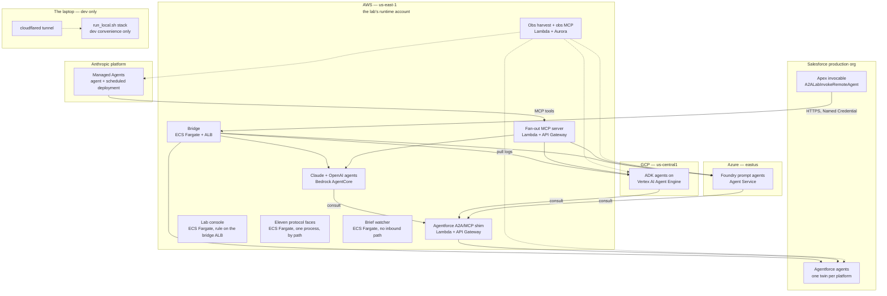
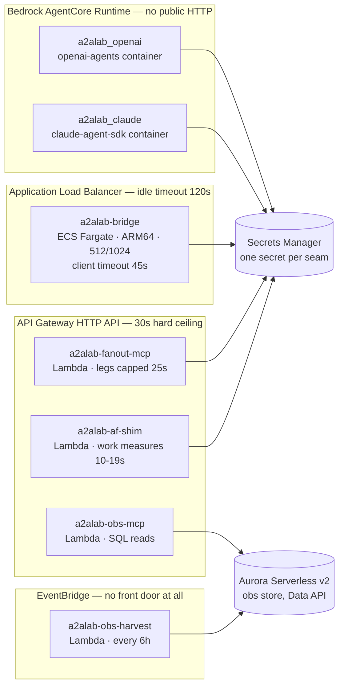
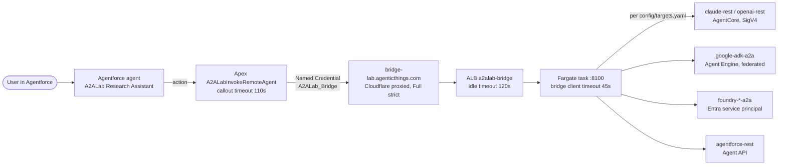
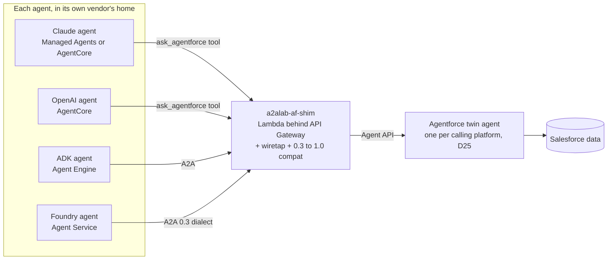
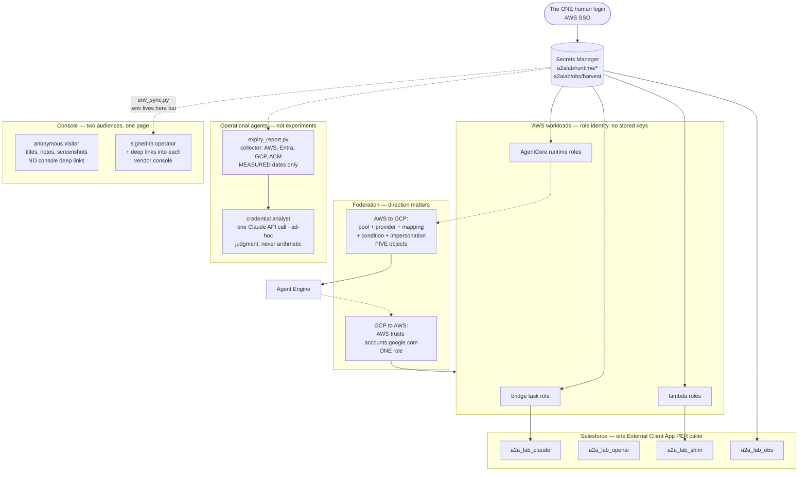
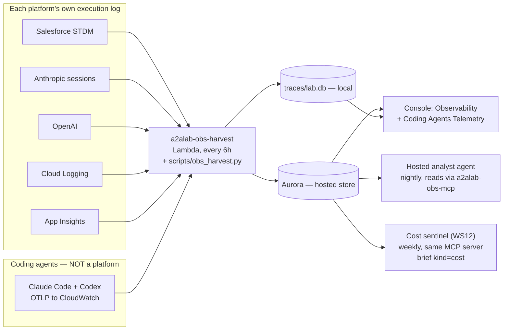
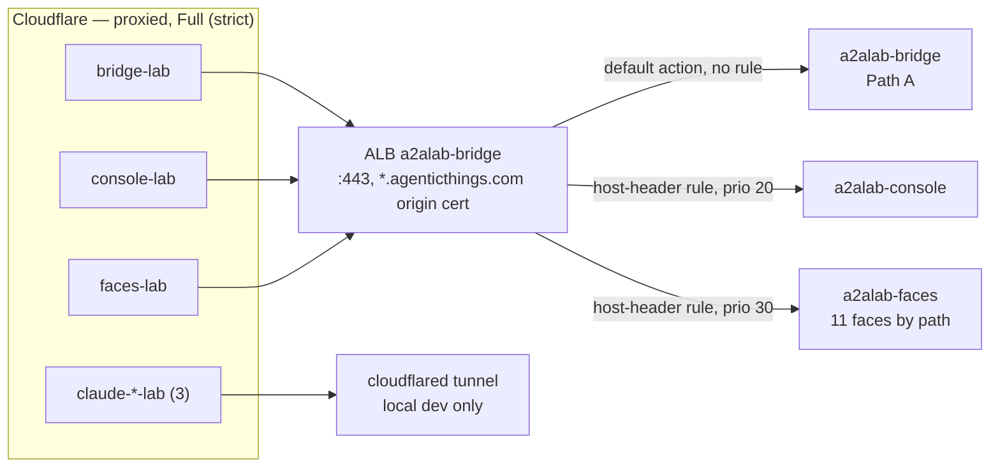
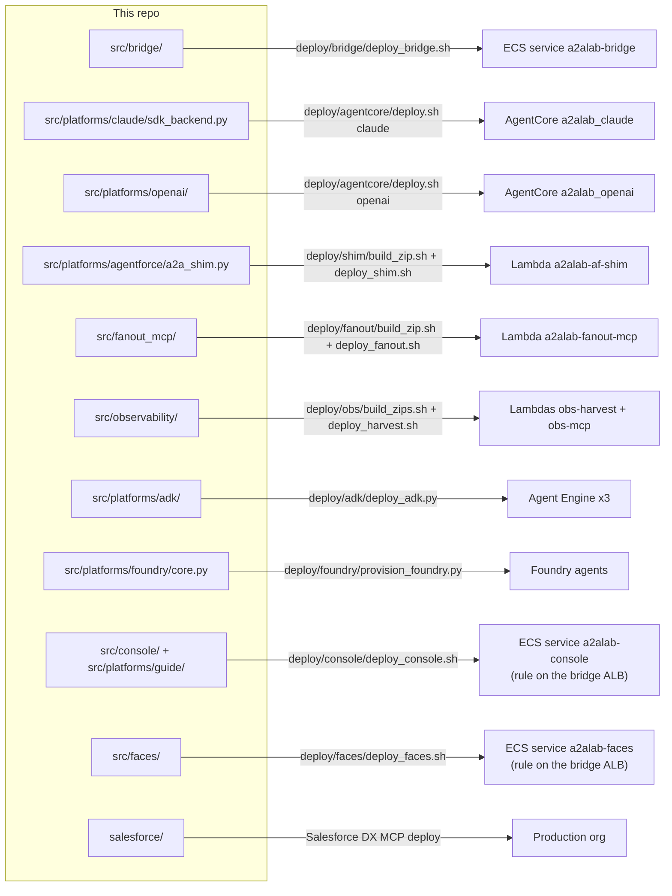

# Deployment map — where everything runs, and why

**What this file is for.** `plan/01-architecture.md` answers *how the code is
shaped* (the two seams, the protocol mapping, the trace layer).
`plan/00-decisions.md` answers *why each choice was made*, one decision at a
time, in the order they happened. Neither answers the question you actually ask
when you open a cloud console: **what is deployed, where, and why there.**

That question got harder on 2026-07-26, when the Path A bridge moved to ECS
Fargate behind an ALB while every other hosted component stayed on Lambda
behind API Gateway. Two components, same account, opposite hosting decisions —
which is correct, and confusing, unless the reason is written down next to the
picture.

**How to read it.** Eight levels, each a diagram plus what it is and why it is
that way. L0 is the whole estate on one screen. L6 maps repo files to deployed
artifacts. Read down until you have the detail you need, then stop.

- **L0** — the estate: five homes, one lab
- **L1** — AWS: four hosting shapes, four different reasons
- **L2** — Path A end to end: Salesforce reaches out
- **L3** — Path B end to end: the platforms reach into Salesforce
- **L4** — identity: who authenticates as what, and which way federation runs
- **L5** — observability: five interiors, one store
- **L5.5** — DNS: the four hostnames, and what each one is for
- **L6** — code → deployment: which file becomes which running thing

**What this is written from.** The deploy scripts in this repo and the measured
results in `plan/03-results.md` — not generated from live cloud state. Every
number is one the lab recorded, and "Checking reality" at the end gives the
commands that print what is actually deployed right now. Every file named
below links to the source.

---

## L0 — The estate: five homes, one lab



**What you are looking at.** Five places hold something the lab depends on, and
one of them — the laptop — no longer holds anything on a live call path.

**Why it is spread like this.** Not for redundancy; deliberately, because the
lab's subject *is* cross-platform interop. An agent on each major platform, each
in its vendor's own native home, is the experiment. The alternative — running
everything as containers in one cloud — would test our containers, not the
platforms.

**The one asymmetry worth knowing:** AWS is not just a peer. It is where the
lab's *own* infrastructure lives (bridge, shim, fan-out, observability store),
because AWS is the only account with an SSO login the lab treats as its single
human credential (D39). GCP and Azure hold platform-native agents and nothing
else.

---

## L1 — AWS: four hosting shapes, four different reasons



**What you are looking at.** Four hosting shapes in one account, and the shape
is chosen by **what the component's work costs in seconds**, not by preference.

| Shape | Who | Why this one |
|---|---|---|
| Lambda + API Gateway HTTP API | shim, fan-out MCP, obs MCP | Cheapest thing with a public URL. Its integration timeout maxes at **30s and is not adjustable** — fine, because each of these finishes well inside it. |
| ECS Fargate + ALB | **the bridge** | Path A's budget is **45s** (action ~85-90s → Apex 110s → bridge 45s). An HTTP API would have silently cut 15s off the lab's sync research depth. An ALB's `idle_timeout` is a settable attribute — set to **120s** on every deploy so a console edit cannot reintroduce the ceiling. |
| Bedrock AgentCore Runtime | Claude + OpenAI self-hosted agents | The point of D26: an agent runtime with an **IAM data plane and no public HTTP endpoint**. Callers use `invoke_agent_runtime` with SigV4; there is no URL to leak. |
| EventBridge → Lambda | obs harvest | Nothing calls it. It wakes up, pulls each platform's logs, writes Aurora, sleeps. |

**The rule to take away:** *host to the measured ceiling, not the observed
average.* Six of six pathways through the hosted bridge measured **1.2–12.6s**
— every one would have fit an API Gateway. The ALB is there for the delegating
turns the 45s budget exists to cover, not for the median call.

**The trap this shape hides.** Federation is not portable across AWS compute
types. The AWS→GCP federation built for the fan-out **Lambda** failed on
**Fargate**: google-auth's default AWS supplier looks at `AWS_ACCESS_KEY_ID`
env vars, then EC2 IMDS. Lambda sets the env vars; Fargate sets neither, because
an ECS task's credentials come from `$AWS_CONTAINER_CREDENTIALS_RELATIVE_URI`.
Same code, same role, same pool, different compute shape, stops working. Fixed
by delegating to **botocore**, which resolves all of them.

---

## L2 — Path A end to end: Salesforce reaches out



**What you are looking at.** The one path that starts *inside* Salesforce.
Agentforce's outbound is REST-only, so Apex calls one endpoint — the bridge —
and the bridge fans out to whatever `config/targets.yaml` says. **Switching the
protocol or the target platform needs no Salesforce redeploy.** That indirection
is the whole reason the bridge exists.

**The budget chain is the design.** Every number is measured, not assumed:
Agentforce action ~85–90s (measured 2026-07-25, not the ~60s long assumed) →
Apex callout 110s → bridge client 45s → agent-side caps. Each layer must be
comfortably inside the one above it, and the ALB's 120s idle timeout sits above
all of it.

**What is still manual here, deliberately:** TLS and DNS. The cutover moved
`bridge-lab.agenticthings.com` from the Cloudflare tunnel to the ALB. It is a
Salesforce-visible hostname, so it was verified on the ALB's own hostname over
HTTP first — a DNS change against a known-good target rather than a deploy and
a hope.

---

## L3 — Path B end to end: the platforms reach into Salesforce



**What you are looking at.** The mirror of Path A. Agentforce has no GA
inbound MCP or A2A surface, so the lab supplies one: a shim that speaks A2A and
MCP on the outside and the Agent API on the inside.

**Why the shim is hosted rather than local.** Two platform-native A2A callers
(Foundry, and Agent Engine) must reach a public endpoint, and pointing them at a
laptop through a tunnel would make the experiment about the tunnel. Hosting it
also bought the **wiretap**: the shim records the raw inbound A2A envelope, which
is the only place the lab can see what a vendor's A2A client actually sends.

**Two things the shim absorbs that are worth naming:**
- **Dialect translation.** Foundry speaks A2A **0.3**; Agent Engine requires
  **1.0**. `interop/servers/a2a_compat.py` translates, so neither vendor has to
  be wrong for the other to work.
- **The 29s gateway wall.** The shim is on API Gateway, and Foundry's A2A tool
  does **not** retry — so a cold twin session behind that ceiling fails the tool
  call outright. The lab's answer is a warm-up path rather than a retry, because
  the caller is a platform whose retry behaviour is not ours to change.

**Every calling platform gets its own Agentforce twin** (D25), so each
experiment stays a closed two-platform system rather than four platforms
sharing one agent's session history.

---

## L4 — Identity: who authenticates as what, and which way federation runs



**What you are looking at.** The rule from D39: **AWS SSO is the only
interactive human login in the stack.** Every other platform credential is a
service identity fetched with that AWS session — never an `az login`, never a
`gcloud auth`, never a value that exists only in someone's `.env`.

**Why per-caller Salesforce apps.** One shared External Client App held the
*union* of four callers' needs. Splitting it into four apps was not about a
shorter scope list — Salesforce attributes client-credentials calls to the
**app**, so one shared app made every lab caller look like one integration user
in the org's own audit trail. The modelling error showed up as an observability
failure.

**Why the federation box is lopsided.** AWS trusts `accounts.google.com`
natively and needs **one** role. Google needs **five** objects before it will
trust AWS at all. "Keyless federation" costs very different amounts depending on
direction, and Google's side is where the identity is *shaped* rather than
merely accepted.

**The last file that broke the rule, and how it was closed.** D39 says every
credential is a service identity fetched with the one human login — but `.env`
itself was a plaintext file holding every platform's keys, existing on exactly
one laptop. Losing it would not lose the code; it would lose the ability to run
or deploy it. It is now stored in Secrets Manager alongside the others and moved
with `scripts/env_sync.py pull|push|diff`, so onboarding is **clone →
`aws sso login` → `env_sync.py pull`**. `.env.example` stays the checked-in
contract describing what each key means; only the values live in the secret, and
only for identities the secret's IAM policy already admits.

Two related rules make that safe rather than merely convenient:

- **No environment identifier is hardcoded in the repo** — no account ids, no
  project ids, no SSO profile name, and no `${VAR:-default}` fallbacks, which
  are hardcodes that only reveal themselves on someone else's machine. Shell
  reads `${VAR:?set VAR in .env}` so a missing value fails at the top instead of
  quietly targeting the wrong cloud. A test fails the build if an AWS account id
  or profile name reappears in a tracked file.
- **Every AWS deploy proves its target account first.** `deploy/aws_preflight.sh`
  resolves the session with `sts get-caller-identity` and refuses to continue
  unless it matches `A2ALAB_AWS_ACCOUNT_ID`. Removing the account label from the
  repo makes a wrong-account deploy *easier* to attempt, so the guard went in
  with the scrub, not after it.
- **The console's public surface names no accounts either.** `/api/scenarios`
  and `/api/targets` are unauthenticated — the landing exhibit renders from
  them — and they carried the vendor console deep links, which is where the
  Salesforce org's my-domain, the GCP project id and an Azure tenant id all
  live. An anonymous caller now gets the component titles, notes and
  screenshots; the links resolve only for a signed-in caller, and the UI says
  *"sign in to open"* rather than *"not yet available"*, which would be a claim
  about the lab instead of a statement about the viewer.

### Credential health: a collector, and an agent above it

Every credential in the estate expires, and the dangerous ones expire quietly.
`scripts/expiry_report.py` queries each provider for the date it already knows —
the AWS SSO session, the CloudWatch metrics key from IAM, the Entra app secret,
GCP service-account keys, and the Cloudflare origin certificate imported into
ACM for Path A's Full (strict) hop. Anything no API will answer for (Salesforce
ECA secrets, the tunnel credential) is **declared** in
`config/credentials.yaml` and labelled as such, so an intention never reads as a
measurement.

Above it sits the **credential analyst** — one Claude API call, and the lab's
first agent doing operations rather than experiments. It is handed the
measured report and asked what a threshold cannot answer: what to rotate first,
what each failure would look like, and what the report does not cover. On its
first run it found something neither the script nor the operator had noticed —
the GCP key and the Entra secret expire within days of each other next July, so
that is one coordinated rotation rather than two events — and flagged that the
no-expiry GCP key is the only credential that will never prompt anyone.

Four design choices, each deliberate:

- **The collector is deterministic and the agent never computes a date.** D22's
  rule (ETL below, interpretation above) applied to credentials. The agent's
  instructions forbid citing any number not in the report.
- **It is a plain API call, not a Managed Agent — and it was built both ways.**
  The first version was a Managed Agent and it worked; then the shape was
  checked against what that abstraction is for. Hosted tool execution: no tools.
  Scheduled deployments: cannot be scheduled, see the next bullet. Session
  state: one shot. Managed sandbox: unused. What it cost was real —
  `agents.create` + `sessions.create` + `events.send` + idle detection, a setup
  step, a state file, an agent object to version, and a bug that existed only
  because of the extra surface. A single `messages.create` is the same model,
  the same prompt, the same data, in one round trip. D44 records the three tests
  it failed and names the cost sentinel as the counter-example that passes them;
  the moment collection moves server-side, this should go back.
- **It is ad-hoc, not scheduled** — which is a limitation, stated. Collection
  needs the operator's own AWS SSO session, `az` login and `gcloud` ADC, so a
  cron firing in Anthropic's sandbox would report "cannot query" every night and
  train everyone to ignore it. Nothing runs unless a person starts it.
- **It is fed, not tooled.** The obs analyst reads its store through a hosted
  MCP server; this one does not, because putting "which secrets expire when"
  behind an internet-reachable endpoint to save a copy-paste is a poor trade.
- **Read-only.** An agent that could rotate credentials across four clouds could
  lock the lab out of itself.

Operators reach it from the console's Architecture page → **Credentials**, which
shows the measured table and an **Analyze** button.

**Two things that generalise past this lab.** First: **a repo scrub is not a
boundary — the API is.** The identifiers were removed from the source and were
still being served by a public endpoint, because the endpoint assembled them at
runtime from `.env`. Anything derived from configuration has to be checked at
the edge it is served from, not only where it is written.

Second: **the same identifier can be necessary in one place and decoration in
another.** The Foundry console URL carried `?tid=<tenant-id>`, a sign-in hint
the browser does not need when the session is already in that tenant — so it
was stripped. `AZURE_TENANT_ID` remains in `.env`, because the Entra service
principal genuinely authenticates with it. Removing an identifier is only cheap
when you can tell those two cases apart; the test is whether anything stops
working without it.

---

## L5 — Observability: five interiors, one store



**What you are looking at.** Harvest-and-cache (D18): the console **never**
proxies a platform API live. Every interior view is pulled into one store first,
so the console is fast, offline-capable, and shows the same thing twice.

**The one deliberate exclusion.** `coding` shares the harvest seam and the store
but is **not** a sixth column in the coverage panel. Every column there is an
agent platform whose interior the lab harvests; Claude Code and Codex are the
tools that *built* the lab. It gets its own console section instead.

**Two agents read this store, and only one of them earns the shape.** The
observability analyst runs nightly; the **cost sentinel** (WS12/D44) runs weekly
over the coding-agent telemetry and explains what moved. Both reach the store
through the same `a2alab-obs-mcp` server and write to the same
`lab.obs_briefs` table, separated by a `kind` column — one store, one reader,
one migration. Both are created **paused**: a scheduled firing bills a real
session, so the schedule is opt-in.

The sentinel is the counter-example to the credential analyst above. That one
was demoted to a plain API call because it had no tools, no possible schedule
and no state. The sentinel has all three — the delta is a SQL question, the
collection already runs in `a2alab-obs-harvest` rather than on a laptop, and
week-over-week needs history. Same lab, same rule, opposite answer.

**The obs rule that keeps biting:** registering a source in
`scripts/obs_harvest.py` is *half* the job. The hosted Lambda
(`observability/lambda_handlers.py`) and its bundle (`deploy/obs/build_zips.sh`)
need the same entry and the client library — or the platform reads "blocked"
hosted forever while local looks fine. **Proven again on 2026-07-27** (D46): the
`coding` source existed locally for two days while Aurora held zero rows,
because the deployed bundle predated it *and* the execution role had no PromQL
grant — and an unauthorized read surfaces as the friendly "no coding metrics
yet, switch the exporters on" status, so empty and forbidden look identical.

**The store now holds two things that are not telemetry**, both because a hosted
console cannot read a laptop's filesystem (WS13):

- `lab.lab_state` — key/value, for operator artifacts the console *renders* but
  cannot *produce*. The credential expiry snapshot lives here: collecting it
  needs the operator's own AWS/az/gcloud sessions, so it can never run in the
  container. `scripts/expiry_report.py --write` publishes to both the file and
  the store; the console reads the store first.
- `lab.fanout_tasks` — the durable half of A2A fire-then-poll (WS11/D47). On a
  function runtime, in-memory task state is per-instance and background work is
  frozen between invocations, so a submit/check pair that keeps state in the
  process is broken in two separate ways.

**Schema changes go through `scripts/pg_migrate.py`**, which connects as the
table owner. `pg_backfill.py` moves rows and cannot ALTER — the split that D46
exists to record.

---

## L5.5 — DNS: the four hostnames, and what each one is for



Every public entrance to the lab is a **CNAME in Cloudflare, proxied (orange),
with SSL/TLS mode Full (strict)** — and, since the WS13 cutover, three of the
four point at the *same* ALB. Recorded here because a hostname is the one piece
of the estate no script creates: each is a hand-made record, and a lab that is
otherwise fully deployed still has four manual steps hiding in it.

| Hostname | Points at | Serves | Created |
|---|---|---|---|
| `bridge-lab` | ALB `a2alab-bridge` | Path A — the Apex callout's Named Credential target. **Salesforce-visible**, so this is the one to change carefully | 2026-07-26 (WS7 item 7) |
| `console-lab` | the same ALB | The lab console, routed by a host-header rule (priority 20) | 2026-07-28 (WS13 item 1) |
| `faces-lab` | the same ALB | All eleven protocol faces, rule priority 30, addressed by **path**: `/<target-name>/...` | 2026-07-28 (WS13 item 2) |
| `claude-rest-lab`, `claude-mcp-lab`, `claude-a2a-lab` | the `cloudflared` tunnel | Local development only. Superseded for hosted use by `faces-lab`; kept because the tunnel is now a dev convenience rather than the front door | M6 |

**Why three hostnames and one load balancer.** The ALB terminates TLS on :443
with the imported Cloudflare Origin certificate for `*.agenticthings.com`, so
every lab hostname is already covered and a new face needs **no new
certificate** — just a listener rule and a target group. The bridge stays the
listener's *default action* and carries no rule, which is what makes adding a
face safe: a malformed host condition can only make the new face unreachable,
never Path A.

**Why `faces-lab` is one record and not nine.** Nine faces addressed by hostname
would be nine hand-made DNS records and nine listener rules. Addressed by path
they are one of each (D51), and the mount prefix is the target name — so
`claude-mcp` lives at `https://faces-lab.../claude-mcp/mcp`.

**The corporate-proxy caveat.** The operator's proxy blocks this whole domain at
DNS, so none of these hostnames resolve from the work laptop with the proxy on
(measured: a hostname that never existed still hangs 30s, plan/03-results.md).
That is not a deployment fault and no front door fixes it — with nothing running
locally there is no cost to dropping the proxy to look. Verify from inside AWS,
or against the ALB's own hostname with a `Host:` header, which is how every
cutover in this file was checked.

---

## L6 — Code → deployment: which file becomes which running thing



**The full mapping, including what each deploy actually creates:**

| Repo path | Deploy command | Becomes | Where |
|---|---|---|---|
| `src/bridge/` | `deploy/bridge/deploy_bridge.sh` | ECR image + ECS task def + service `a2alab-bridge` on cluster `a2alab`, ALB + target group + listener, roles `a2alab-bridge-task` / `-exec`, secret `a2alab/runtime/bridge` | AWS |
| `src/platforms/claude/` (sdk backend) | `deploy/agentcore/deploy.sh claude` | AgentCore runtime `a2alab_claude` + secret `a2alab/runtime/claude` | AWS |
| `src/platforms/openai/` | `deploy/agentcore/deploy.sh openai` | AgentCore runtime `a2alab_openai` + secret `a2alab/runtime/openai` | AWS |
| `src/platforms/agentforce/` (shim) + `deploy/shim/handler.py` | `build_zip.sh` then `deploy_shim.sh` | Lambda `a2alab-af-shim` + API Gateway HTTP API + secret `a2alab/runtime/shim` | AWS |
| `src/fanout_mcp/` | `build_zip.sh` then `deploy_fanout.sh` | Lambda `a2alab-fanout-mcp` + API Gateway + secret `a2alab/runtime/fanout-mcp` | AWS |
| `src/observability/` | `deploy/obs/build_zips.sh` then `deploy_harvest.sh` / `expose_mcp.sh` | Lambdas `a2alab-obs-harvest` (EventBridge 6h) and `a2alab-obs-mcp` (+ API Gateway), secret `a2alab/obs/harvest`, role policy `a2alab-obs-promql` | AWS |
| `src/obs_mcp/` | `deploy/obs/expose_mcp.sh` (`--code` for code alone) | Function code for `a2alab-obs-mcp`. **Nothing pushed this zip until 2026-07-27** — `expose_mcp.sh` built the API and left the code to a hand-run `update-function-code` | AWS |
| `observability/pg.py` `DDL` | `scripts/pg_migrate.py` | Schema changes in Aurora `a2alab`, run as the **table owner**. `pg_backfill.py` (rows only) connects as `lab_writer`, which cannot ALTER | AWS |
| `src/platforms/adk/` | `deploy/adk/deploy_adk.py` | Agent Engine deployments `a2alab-adk-researcher`, `a2alab-supply-orchestrator-adk`, `a2alab-logistics-agent` | GCP |
| — | `deploy/adk/provision_aws_federation.py` | GCP→AWS trust: one IAM role | AWS |
| — | `deploy/fanout/provision_gcp_federation.py` | AWS→GCP: pool, provider, mapping, condition, impersonation | GCP |
| `src/platforms/foundry/core.py` | `deploy/foundry/provision_foundry.py`, `provision_leg_agent.py` | Foundry agents + RemoteA2A connection to the shim + inbound A2A | Azure |
| `src/console/` + `src/platforms/guide/` | `deploy/console/deploy_console.sh` | ECR image + task def + ECS service `a2alab-console` on cluster `a2alab`, target group + **host-header rule on the bridge's existing ALB** (no second load balancer), roles `a2alab-console-task` / `-exec`, secret `a2alab/runtime/console`. Deployed 2026-07-28; DNS still points at the tunnel | AWS |
| `src/faces/` (the nine protocol faces) | `deploy/faces/deploy_faces.sh` | ECR image + task def + ECS service `a2alab-faces`, target group + host-header rule on the bridge's ALB, roles `a2alab-faces-task` / `-exec`, secret `a2alab/runtime/faces`. **One process serves all eleven, addressed by path** | AWS |
| `src/briefs/` (the watcher) | `deploy/briefs/deploy_briefs.sh` | ECS service `a2alab-briefs` on the shared cluster, roles `a2alab-briefs-task` / `-exec`, secret `a2alab/runtime/briefs`. **Reuses the faces image**, no ALB, no target group — it serves nothing | AWS |
| `salesforce/` | Salesforce DX MCP deploy | Apex `A2ALabInvokeRemoteAgent`, Named/External Credentials, External Client Apps | Salesforce |
| `.claude/settings.local.json` + `scripts/codex_otel.sh` | — | OTLP exporter config; metrics land in CloudWatch | laptop → AWS |
| `.env` (gitignored) | `scripts/env_sync.py push` | Secrets Manager secret `A2ALAB_ENV_SECRET` — every platform credential, the account ids, the project ids | AWS |
| `scripts/credential_analyst.py` | — (no deploy step) | **Nothing hosted** — one `messages.create` per run, started by a person | laptop → Anthropic API |
| `scripts/setup_cost_sentinel.py`, `scripts/cost_sentinel.py` | `setup_cost_sentinel.py` | Managed Agent "A2ALab Cost Sentinel" + weekly scheduled deployment (created **paused**) + its own vault on the obs MCP server | Anthropic |

**What is still on the laptop, and whether that is a problem:**

| Still local | Problem? |
|---|---|
| The console (`:8200`) and the Lab Guide | **No longer local** — on ECS Fargate since 2026-07-28 (WS13 item 1). `cloudflared` still serves the hostname until DNS is cut over, and stays afterwards for local development. |
| The protocol servers (`:8001`–`:8003`, `:8011`–`:8013`) | No — the hosted equivalents are the AgentCore runtimes; these are the dev loop. |
| `cloudflared` tunnel | Reduced — the bridge left it on 2026-07-26. It still fronts the console and the direct protocol hostnames. |
| The brief watcher (`python -m briefs --watch`) | **Yes** — the last laptop dependency on a live path, and the open half of WS7. |

### How this got here: local first, then hosted, one component at a time

That table is a progress bar, and it is worth reading as one. Every component
above started as a process on a laptop reached through a tunnel, and each moved
out only once there was a reason and a measurement:

| When | What moved | What forced it |
|---|---|---|
| Start | everything local, tunnel-fronted | fastest way to get a real cross-platform call working at all |
| D26 | Claude + OpenAI agents → AgentCore | a self-hosted agent that only exists on a laptop cannot be demonstrated as a *runtime* |
| D28 | Agentforce shim → Lambda | two platform-native A2A callers must reach a public endpoint; pointing them at a tunnel makes the experiment about the tunnel |
| D23 | observability store → Aurora, harvest → Lambda | a 6-hourly pull cannot depend on a laptop being awake |
| D41 | fan-out legs → remote MCP server | host-side tools need a laptop attached for the whole run |
| WS7 item 7 | **the bridge → Fargate + ALB** | it was the last thing on Path A's live call path; the ALB was needed because the 45s budget would not fit a gateway |
| open | the brief watcher | the remaining one |

The order was not planned up front. Each move was triggered by a specific thing
the local version could not do, which is why the hosting shapes differ — they
were chosen against different constraints, years of architecture-review advice
about "consistency" notwithstanding. Keeping the sequence visible is the point:
it shows a lab that earned its way to hosted rather than starting there.

---

## Checking reality

The diagrams above describe intent as committed to the repo. These commands
print what the accounts actually hold right now:

```sh
# AWS — the four shapes
aws ecs describe-services --cluster a2alab --services a2alab-bridge \
  --query 'services[0].{status:status,running:runningCount,task:taskDefinition}'
aws elbv2 describe-load-balancers --names a2alab-bridge \
  --query 'LoadBalancers[0].DNSName'
aws lambda list-functions --query "Functions[?starts_with(FunctionName,'a2alab')].FunctionName"
aws bedrock-agentcore-control list-agent-runtimes --query 'agentRuntimes[].agentRuntimeName'
aws secretsmanager list-secrets --query "SecretList[?starts_with(Name,'a2alab')].Name"

# The one that matters for Path A's budget — must print 120
aws elbv2 describe-load-balancer-attributes --load-balancer-arn "$(aws elbv2 \
  describe-load-balancers --names a2alab-bridge --query 'LoadBalancers[0].LoadBalancerArn' \
  --output text)" --query "Attributes[?Key=='idle_timeout.timeout_seconds'].Value"

# GCP / Azure
gcloud ai reasoning-engines list --region us-central1
az account show

# The lab's own answer: every caller identity proving it can still do its job
uv run python scripts/identity_preflight.py
```

`scripts/identity_preflight.py` is the closest thing to a live map: it makes
every caller identity mint its own token and run its own call, and fails if any
cannot.

---

## Why not, in one place

The choices above that look inconsistent until you know what drove them:

| "Why didn't you…" | Because |
|---|---|
| …put the bridge on API Gateway like everything else? | 30s hard ceiling vs a 45s measured budget. The ALB's idle timeout is settable; the gateway's is not. |
| …put the shim on Fargate too, for consistency? | Its work measures 10–19s. Consistency is not a reason to pay for a load balancer. |
| …run all the agents in one cloud? | Then the lab tests our containers, not the platforms. Each agent lives in its vendor's native home on purpose. |
| …give the AgentCore runtimes a public URL? | They have an IAM data plane instead. There is no URL to leak, and callers are authorized by role. |
| …use one Salesforce connected app? | Salesforce attributes client-credentials calls to the app, so one app makes every caller look like one user in the audit trail. |
| …store platform keys in the task definitions? | D39. Task definitions carry a secret ARN; the values are fetched at start from Secrets Manager. |
| …automate the TLS/DNS cutover? | It is a Salesforce-visible hostname. Verified on the ALB's own hostname first, then one DNS change against a known-good target. |
| …give the console a CDN front door so it works behind the corporate proxy? | Tried and reverted 2026-07-27. It worked — but it solved the wrong problem. The proxy blocks the lab's whole domain at DNS (a hostname that never existed still hangs 30s), so no front door fixes the *domain*, and the operator is content to drop the proxy to view the console. What actually hurt was the laptop being on the runtime path, which is WS13. |
| …keep sqlite as the console's observability store? | D49. It was, and that was the bug: the hosted harvest wrote Aurora, the local harvest wrote `traces/lab.db`, and the console read only the file — so the dashboard showed the laptop's copy while the authoritative one drifted. Postgres is the source of truth now, chosen in one place, with sqlite kept only for offline work on a snapshot. |
| …make the brief watcher an EventBridge Lambda? | That is what WS13 item 3 assumed, and it was the wrong shape. Its work is a poll LOOP, and a Lambda would need a third zip carrying the Anthropic SDK, httpx and the Salesforce client — another bundle to build and keep in step (D46's whole subject). The faces image already contains the code and every dependency, so the watcher is that image with a different command, at ~$4/month. |
| …run each protocol face as its own service? | D51. Nine Fargate tasks (~$80/month) to run nine `uvicorn`s, when every face is an ASGI app that `build_app()` already returns without a server. One process serves all eleven, addressed by PATH rather than by nine hostnames — nine DNS records somebody creates by hand, against one, for no behavioural difference. It also sidesteps ECS's limit of five target groups per service. |
| …give the console its own load balancer? | A second ALB is ~$16/month for nothing. The bridge's already terminates TLS on :443 with the `*.agenticthings.com` origin cert, so an extra face costs a target group, a **host-header rule** and a task. The bridge stays the listener's default action and carries no rule, so a wrong host pattern can only make the console unreachable — it cannot break Path A. |
| …trust that a deploy which passes its own runbook is verified? | D48. The console's first hosted run passed every check — image, secret, rule, stable service, `/healthz` 200 — while serving every `/api` surface unauthenticated, because its runtime secret was created, shipped and never loaded, and the auth middleware treats a missing token as *auth is off*. A valid-token check proves nothing when all tokens are accepted; the negative test is the one that finds it. |
| …make the credential analyst a Managed Agent like the other two? | It was one, and it was demoted (D44). Its work is one round trip over a report a person just collected — no tools, no schedule, no state. The agent object, setup step and state file were surface with nothing behind them. |

## Presenter notes

Prep and delivery notes for the lab owner. The console renders this section
**only** for a signed-in reviewer (`config/users.yaml`, `reviewer: true`) — it
is not part of the document a reader or colleague sees.

**Before presenting this page**

- The map is written from the deploy scripts, not from live state. Run the
  "Checking reality" commands first if it has been a while — the one that
  matters most is the ALB idle timeout, because a silent reset to 30s takes
  Path A's 45s budget with it and the diagrams would still claim 120s.
- `uv run python scripts/identity_preflight.py` is the fastest single proof the
  estate is healthy: every caller identity mints its own token and makes its own
  call. If it passes, L4 is true as drawn.
- Warm the shim before any live Path B demo. Foundry's A2A tool does not retry,
  so a cold twin session behind the 29s gateway ceiling fails the tool call
  outright — and it fails as a *fabricated* answer, not an error.
- AWS SSO expires. `aws sso login --profile $AWS_PROFILE` with Zscaler ON; then VPN
  OFF again for the local console.

**Questions this deck reliably gets, and the answer that lands**

- *"Why is one component on Fargate when everything else is Lambda?"* — Do not
  answer with preference. Answer with the number: the bridge's budget is 45s,
  an HTTP API's ceiling is 30s and is not adjustable, an ALB's is an attribute.
  Then the general rule: host to the measured ceiling, not the observed average.
- *"Isn't four clouds over-engineered?"* — The subject of the lab is
  cross-platform interop. Running every agent as our own container in one cloud
  would test our containers, not the platforms. Say that before the diagram
  invites the question.
- *"How do you keep this document true?"* — `CLAUDE.md` requires updating it in
  the same change as any deploy, and the honesty sweeps audit the claims. Be
  honest that the convention alone was not sufficient: the 2026-07-27 sweep
  found five stale claims across the record.
- *"What is still on a laptop?"* — The brief watcher, and say so plainly. It is
  the open half of WS7 and pretending otherwise is the one thing that would cost
  credibility in this room.

**Where the story is strongest**

L1 is the slide that earns the most respect from infrastructure people: two
components, same account, same team, opposite hosting decisions, each driven by
what its work costs in seconds. L4's lopsided federation box is the second —
"keyless federation" costing five objects in one direction and one in the other
is concrete in a way architecture diagrams usually are not.

## Related

- `plan/01-architecture.md` — the code's shape: the two seams, protocol mapping
- `plan/00-decisions.md` — D20 tunnel, D21 AWS account, D23 hosted obs, D26
  AgentCore, D28 hosted shim, D39 one human login, D40 federation, D41 fan-out
- `plan/03-results.md` — the measured numbers every budget here is built on
- `plan/07-workstreams.md` — WS7 (what is left to host), WS11 (the next change)
- `plan/04-runbooks.md` — how to deploy and recover each piece
