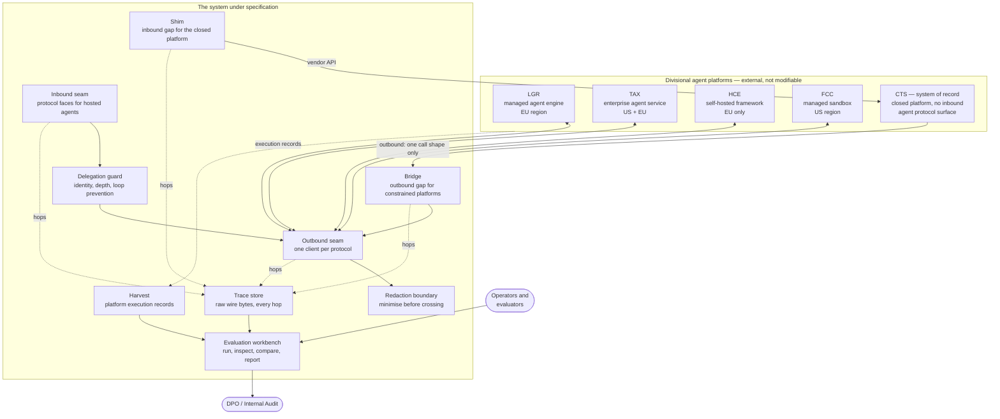

# Scope and System Context

What is being built, what surrounds it, and — stated before any requirement — the
boundary that every requirement is scoped against.

## 1. What the system is

An **agent interoperability evaluation environment**: a system that connects the
organisation's five divisional agent platforms to one another over multiple
inter-agent protocols, records every exchange at the wire level, and produces
comparable evidence about which interoperability patterns work, what they cost,
and where they fail.

It is deliberately an **evaluation environment and not a production integration
platform**, and the distinction is load-bearing:

- Its output is **evidence and a recommendation**, not a business service.
- It carries production-shaped constraints — real identities, real regulatory
  obligations, real data — because an evaluation conducted without them
  measures nothing that will survive contact with production.
- It is expected to be **decommissioned or promoted** on a decision, not run
  indefinitely by default.

An evaluation environment that cannot be trusted to be representative is worse
than none, because it produces confident wrong answers. That is why the
regulatory and identity requirements in this set are as strict as they would be
for a production system, and why the system's own honesty about what it has and
has not proven is itself a requirement rather than a courtesy.

## 2. System context

Two asymmetries in that diagram drive a large share of the requirements.

**`CTS` is a hub and a closed platform at once.** It holds the customer, account
and contract data every other division needs to ground an answer, and it exposes
no general inbound agent-protocol surface. It also has exactly one outbound call
shape available to it. So it needs a **bridge** to call outward and a **shim** to
be called inward — two components that exist purely because the most important
participant is the least open one.

**The redaction boundary sits on the outbound seam, not at the destination.**
Minimisation that happens after a transfer is not minimisation. This placement is
the single most consequential privacy decision in the architecture and is
specified, not left to implementers.

## 3. In scope

| # | Capability | Note |
|---|---|---|
| S1 | Protocol faces for agents the system hosts, over all three protocol classes | The inbound seam |
| S2 | Protocol clients for reaching remote agents, one per protocol class | The outbound seam |
| S3 | Bridge — outbound protocol translation for platforms with a single call shape | Driven by configuration, not code |
| S4 | Shim — inbound protocol surface presented on the closed platform's behalf | Must be labelled non-native wherever reported |
| S5 | Protocol version and dialect compatibility translation | Because neither side negotiates |
| S6 | Synchronous and fire-then-poll invocation | Support verified per platform, never assumed |
| S7 | Fan-out orchestration, 1:many, with explicit partial-failure semantics | Both orchestrator placements compared |
| S8 | Delegation guard — caller identity, depth limit, loop prevention | No protocol in scope supplies this |
| S9 | Redaction and pseudonymisation at the outbound boundary | Enforced, not advisory |
| S10 | Wire-level trace capture and retention for every hop | Credential scrubbing before write |
| S11 | Harvest of platform execution records and join to local traces | Including honest reporting of what will not join |
| S12 | Consumption and cost accounting in separately-billed token buckets | Modelled at list price, labelled as modelled |
| S13 | Evaluation workbench — run scenarios, inspect exchanges, compare, report | The human surface |
| S14 | A scenario library exercising realistic cross-divisional business tasks | Grounded in the divisions' actual processes |
| S15 | A loopback path proving all protocol pairings with no external platform | Prerequisite to trusting any external result |
| S16 | Per-caller service identity for every seam | One identity per caller, scoped to its actual need |

## 4. Out of scope

Recorded as decisions. Several are the kind that get assumed into scope
silently, which is why each carries its reason.

| # | Excluded | Reason |
|---|---|---|
| X1 | Replacing, consolidating or migrating any divisional agent platform | The divisions hold consent, not compliance. Any requirement depending on this is a wish |
| X2 | Externally-facing agent surfaces for customers or partners | Every interaction in scope is internal. External exposure is a different threat model and a different regulatory analysis |
| X3 | Model selection, tuning, fine-tuning or answer-quality evaluation | The system compares interoperability. Each platform's model is a given |
| X4 | Running production business processes on the system | It is an evaluation environment. Promotion to production is a decision this system exists to inform |
| X5 | Streaming / incremental response delivery | Deferred deliberately. Several platforms in the estate buffer responses end to end, so streaming cannot be compared across the estate. Revisit only when a protocol comparison depends on it |
| X6 | Human-in-the-loop approval workflows within agent interactions | Valuable and orthogonal. Adding it would confound the protocol comparison with a workflow comparison |
| X7 | Cost optimisation of the divisional platforms themselves | The system measures and models consumption; it does not tune anyone's platform |
| X8 | High availability and disaster recovery to production standards | An evaluation environment. Availability requirements are stated at evaluation grade and explicitly marked as such |
| X9 | Data migration or synchronisation between divisions | Agents *consult* systems of record. Nothing is copied between divisions as a persistent store |
| X10 | Procurement negotiation and contract commercial terms | The system produces sizing inputs; commercial terms are elsewhere |

## 5. External entities

Everything the system depends on and does not control. Each is a source of
requirements *and* a source of risk, because none of them can be changed.

| Entity | Relationship | What the system must assume |
|---|---|---|
| Divisional agent platforms (×5) | Peers — called and calling | Capabilities are asymmetric between inbound and outbound, documented inconsistently, and change without notice |
| Model providers | Consumed by the platforms and possibly directly | Metered consumption, published rates, regional endpoints, variable cold-start behaviour |
| Corporate identity provider | Authenticates human operators | Available; the system does not implement its own human identity store |
| Per-platform identity systems | Authenticate the system's service callers | Each platform has its own, and they do not federate to one another |
| Secret store | Holds every service credential | One human login; every other credential is a service identity retrieved from here |
| Systems of record | Consulted for grounding data | Authoritative, owned by their division, not replicated |
| Public network | Carries inter-platform traffic | Untrusted. Every seam authenticates independently; no seam relies on network position |

## 6. Assumptions about the environment

Recorded here and carried into `70-delivery/02-risks-assumptions-dependencies.md`
with owners.

- **A1** — Each division will permit a scoped service identity for the system to
  call its platform, without granting broad platform administrative rights.
- **A2** — The closed platform (`CTS`) will continue to expose the vendor API the
  shim depends on, and that API remains generally available rather than preview.
- **A3** — At least two divisional platforms expose a genuinely
  platform-native A2A surface. Without this, every A2A result is a measurement
  of the system's own code talking to itself, and the protocol comparison loses
  its most important cell.
- **A4** — Evaluation traffic volumes are low enough that platform rate limits
  are not the binding constraint. If evaluation scales, this is revisited.
- **A5** — Regional model endpoints exist for the EU for every platform `HCE`
  would need to reach. Where this is false, the correct outcome is a documented
  *finding*, not a workaround.

## 7. Success at the system level

The system succeeds if, at the end of the evaluation, the organisation can
answer all five of these with evidence rather than opinion:

1. Which interoperability patterns work across our actual estate, and which do
   not — stated per platform pair and per protocol, with the failures named.
2. What a cross-divisional agent interaction costs, in consumption and in
   latency, at a unit level that can be scaled to a business volume.
3. Whether a cross-divisional interaction can be made compliant with our
   residency and minimisation obligations — and at what cost in capability.
4. What we would have to **build and keep running** to operate this at scale,
   expressed concretely enough to compare against buying a platform that
   provides it.
5. Which of the above we have **not** established, stated as plainly as the rest.

Point 5 is a requirement, not a caveat. An evaluation environment that reports
only what it proved, without an equally visible account of what it did not, will
be read as having proved everything.
